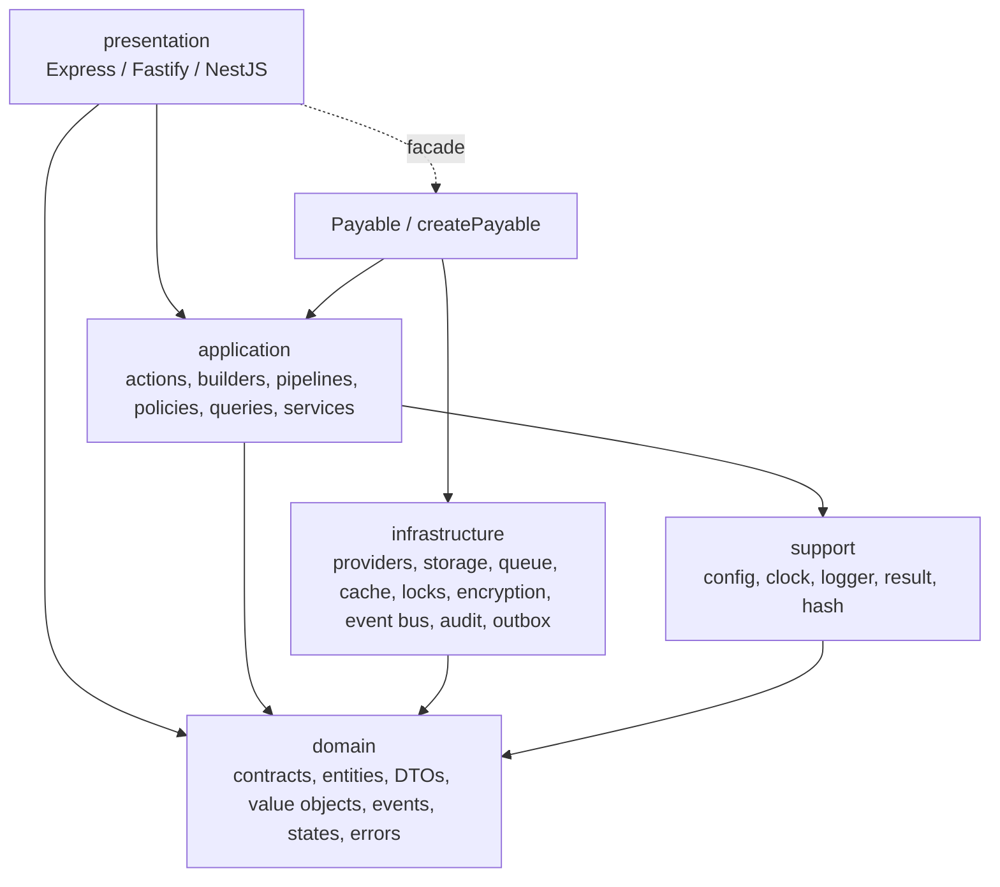

# Architecture

Payable is organized into four layers plus a support layer, matching the top-level directories
under `src/`. The README summarizes them, and the directory tree confirms the split.

## The dependency rule

Dependencies point inward. The domain layer depends on nothing; the application layer depends on
the domain; the infrastructure layer implements domain contracts; the presentation layer depends on
the application and the public facade. The support layer holds framework-free helpers used across
layers.

The facade (`src/payable.ts`, `src/create-payable.ts`) wires resolved configuration (which carries
infrastructure instances) into application actions. It is the one place infrastructure and
application meet, by design - it is the composition root.

## Layers

### Domain (`src/domain`)

- **Purpose.** Define the vocabulary of billing with zero external dependencies.
- **Responsibilities.** Contracts (interfaces every driver must satisfy), entities, DTOs, value
  objects, domain events, state machines, and typed errors.
- **May depend on.** Nothing outside the domain. The contracts are pure TypeScript interfaces; the
  value objects depend only on `dinero.js` (used inside `Money`) and `zod` where validation is
  needed.

### Application (`src/application`)

- **Purpose.** Orchestrate domain operations.
- **Responsibilities.** Actions (each with a `handle()` method), builders (the fluent API),
  pipelines (multi-step flows), policies (authorization checks), queries (read paths), and services
  (idempotency, webhook delivery, provider-capability assertion).
- **May depend on.** The domain and the support layer. It depends on contracts, never concrete
  infrastructure classes - concrete drivers arrive via injected dependency objects such as
  `BillingDependencies` (`src/application/builders/billing-dependencies.ts`).

### Infrastructure (`src/infrastructure`)

- **Purpose.** Implement domain contracts against real systems.
- **Responsibilities.** Stripe/Paddle providers, the Knex storage driver and its repositories, the
  sync/BullMQ queue drivers, memory/Redis cache and lock drivers, the Node encryption driver, the
  in-memory event bus, the audit service, and the outbox service.
- **May depend on.** The domain (the contracts it implements) and optional peer packages (Stripe,
  Paddle, Knex, BullMQ). These peers are imported only inside infrastructure modules, never in the
  core entry.

### Presentation (`src/presentation`)

- **Purpose.** Expose billing operations over HTTP.
- **Responsibilities.** Express routes, the Fastify plugin, the NestJS module, and shared HTTP
  helpers/schemas (`src/presentation/shared`).
- **May depend on.** The application/facade (a constructed `Payable` instance) and an optional HTTP
  framework peer. Each adapter ships on its own subpath export.

### Support (`src/support`)

- **Purpose.** Framework-free cross-cutting helpers.
- **Responsibilities.** Config resolution (`resolveConfig`), the system/fake clocks, the
  console/null loggers, the `Result` type, the request-hash helper, and header redaction.
- **May depend on.** The domain and a small number of infrastructure defaults it instantiates as
  fallbacks (`SyncQueueDriver`, `InMemoryEventBus`) inside `resolveConfig`.

## Directory-to-layer map

| Directory | Layer |
| --- | --- |
| `src/domain/contracts` | Domain |
| `src/domain/entities` | Domain |
| `src/domain/dtos` | Domain |
| `src/domain/value-objects` | Domain |
| `src/domain/events` | Domain |
| `src/domain/states` | Domain |
| `src/domain/errors` | Domain |
| `src/application/actions` | Application |
| `src/application/builders` | Application |
| `src/application/pipelines` | Application |
| `src/application/policies` | Application |
| `src/application/queries` | Application |
| `src/application/services` | Application |
| `src/infrastructure/providers` | Infrastructure |
| `src/infrastructure/storage` | Infrastructure |
| `src/infrastructure/queue` | Infrastructure |
| `src/infrastructure/cache` | Infrastructure |
| `src/infrastructure/locks` | Infrastructure |
| `src/infrastructure/encryption` | Infrastructure |
| `src/infrastructure/event-bus` | Infrastructure |
| `src/infrastructure/audit` | Infrastructure |
| `src/infrastructure/outbox` | Infrastructure |
| `src/presentation/express` | Presentation |
| `src/presentation/fastify` | Presentation |
| `src/presentation/nest` | Presentation |
| `src/presentation/shared` | Presentation |
| `src/support/config` | Support |
| `src/support/clock` | Support |
| `src/support/logger` | Support |
| `src/support/result` | Support |
| `src/support/hash` | Support |
| `src/payable.ts`, `src/create-payable.ts`, `src/index.ts` | Composition root / public surface |

## The zero-peer-dependency core guarantee

Every provider, storage, queue, and framework dependency is an optional peer
(`package.json` `peerDependenciesMeta` marks all eight as `optional: true`). The core runtime bundle
must import none of them statically, so an application that uses only the core never needs them
installed.

This is enforced by `scripts/check-core-bundle.mjs` (run via `npm run verify:bundle`). It:

1. Reads the built core entry files `dist/index.js` and `dist/index.cjs`.
2. For each optional peer - `stripe`, `@paddle/paddle-node-sdk`, `knex`, `bullmq`, `express`,
   `fastify`, `@nestjs/common`, `reflect-metadata` - checks for a static ESM import
   (`from"<peer>"`) or a static CJS require (`require("<peer>")`).
3. Fails with a non-zero exit and lists every leak if any static import is found; otherwise prints
   "core bundle clean: no optional peer is statically imported".

Because the check only matches static imports, infrastructure modules that need a peer load it
through dynamic `import()` so the symbol never appears as a static dependency of the core entry.

## Architectural patterns in use

- **Actions with `handle()`.** Domain operations are classes with a `handle()` method, e.g.
  `ReceiveWebhookAction.handle(...)`, `RefundPaymentAction.handle(...)`. The subscription actions
  share an abstract `SubscriptionAction` base (`src/application/actions/subscriptions/subscription-action.ts`).
- **Builders.** The fluent API (`SubscriptionBuilder`, `CheckoutBuilder`, `SubscriptionManager`,
  `CustomerContext`) under `src/application/builders`.
- **Pipelines.** Multi-step flows under `src/application/pipelines` (checkout, subscription
  create/cancel, webhook processing).
- **Policies.** Authorization checks under `src/application/policies`
  (`CanReplayWebhookPolicy`, `CanCreateSubscriptionPolicy`, etc.).
- **Queries.** Read paths under `src/application/queries` (`FindSubscriptionQuery`,
  `ListPaymentsQuery`, etc.).
- **Value Objects.** Immutable types under `src/domain/value-objects` (`Money`, `Currency`,
  `IdempotencyKey`, `CorrelationId`, `TenantId`, status objects).
- **State Machines.** `src/domain/states` for subscription, payment, invoice, and refund
  transitions, built on a shared `transition.ts`.
- **Result type.** `src/support/result/result.ts` provides `Result<T, E>` with `ok`/`err`/`isOk`/
  `isErr`/`unwrap`.
- **Dependency injection via `createPayable`.** All drivers are injected through
  `createPayable(config)`, resolved by `resolveConfig`, and threaded into actions through
  dependency objects.

---

[Previous: Overview](01-overview.md) · [Index](00-index.md) · [Next: Getting Started](03-getting-started.md)
