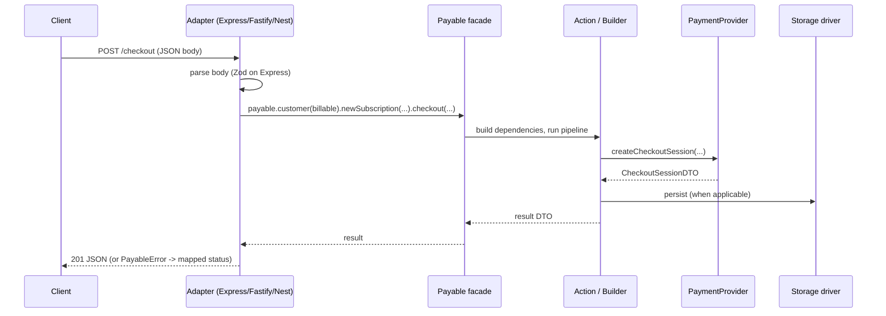
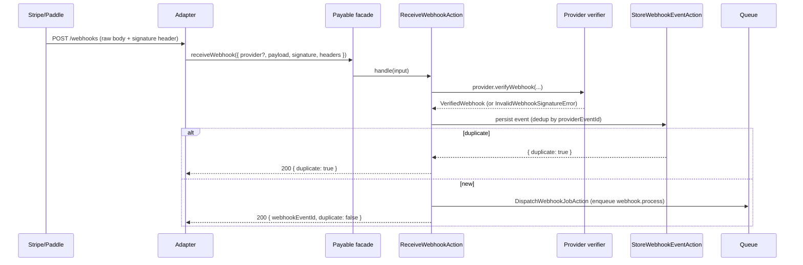
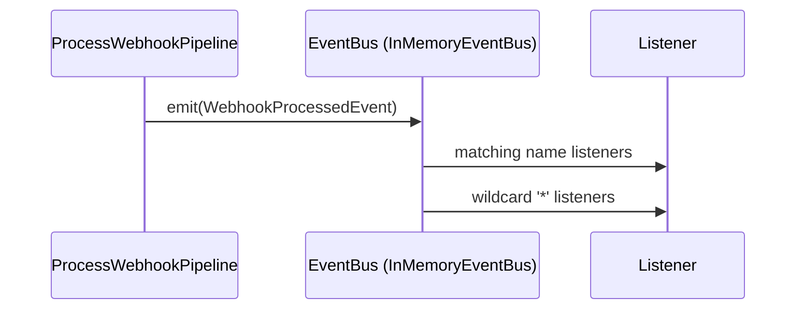
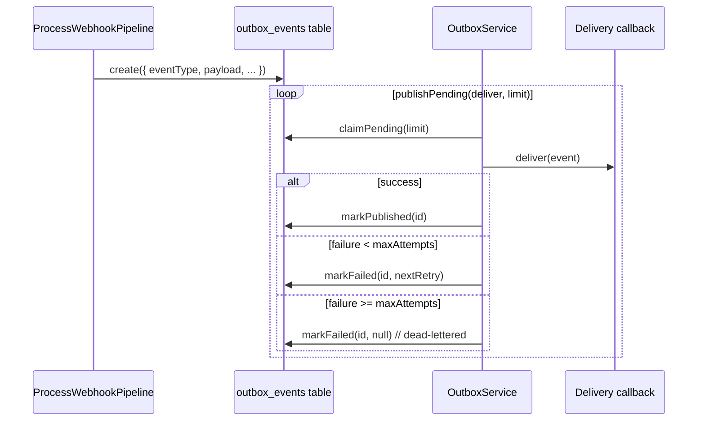
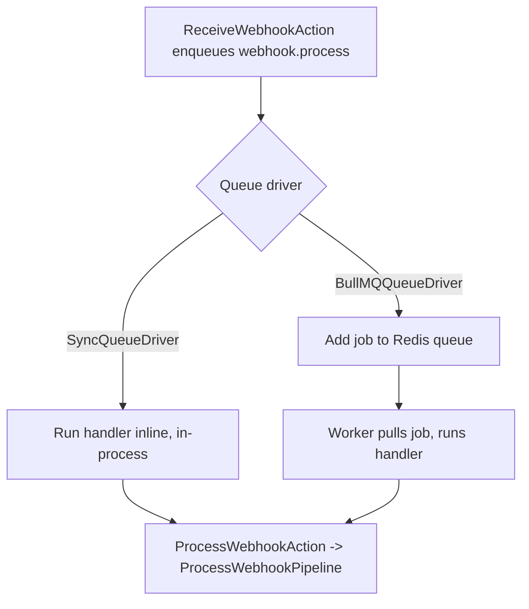

# Data Flows

This page traces the main runtime paths through the system, from HTTP entry to provider, storage,
queue, and event bus. Each flow names the real components involved. For the conceptual webhook
contract see `features/13-webhooks.md`; for queue behavior see `persistence/21-queue.md`.

## Layering recap

Requests enter through an adapter (`src/presentation/*`), call the `Payable` facade
(`src/payable.ts`), which constructs an Action or Pipeline (`src/application/*`). Actions depend on
domain contracts implemented by infrastructure (`src/infrastructure/*`): providers, storage, queue,
event bus, clock. See `docs/02-architecture.md`.

## (a) HTTP request flow

A typical mutating request - checkout, subscription management, or refund - flows from adapter to
facade to action to provider/storage and back.



Concrete bindings:

- Checkout: `registerCheckoutRoutes` -> `payable.customer(...).newSubscription(...).price(...)`
  builder -> `.checkout({ successUrl, cancelUrl })` -> `CheckoutSessionDTO`. Status 201.
- Subscription management: `payable.customer(billable).subscription(name)[action]()` where action
  is `cancel`, `cancelNow`, `resume`, or `swap(price)`. Status 200.
- Refund (Express only): `payable.refund({ paymentId, amount?, reason? })` ->
  `RefundPaymentAction` (`src/payable.ts`). Status 201.

Errors thrown anywhere in this chain are `PayableError` instances; the adapter's error handler maps
`error.code` to an HTTP status via `STATUS_BY_CODE` (`src/presentation/shared/payable-http.ts`).

## (b) Inbound webhook flow

Webhook receipt is split into synchronous receipt (verify, store, enqueue) and asynchronous
processing. This is the high-level view; the full contract is in `features/13-webhooks.md`.



Key points:

- The adapter forwards the raw body string; the provider verifier validates the signature before
  anything is stored.
- `StoreWebhookEventAction` deduplicates by `(provider, providerEventId, tenantId)`. A duplicate
  short-circuits and returns without enqueuing.
- Headers are redacted (`redactHeaders`) and, when an encryption driver is configured, sealed
  before persistence.
- Webhook receipt requires a storage driver; otherwise the facade throws
  `WEBHOOK_STORAGE_REQUIRED`.

## (c) Domain event flow

Processing emits domain events on the event bus. Listeners are registered with `payable.events()`.



`InMemoryEventBus` (`src/infrastructure/event-bus/in-memory-event-bus.ts`) delivers each event to
listeners registered for its `name`, then to listeners registered under the `*` wildcard, awaiting
each in turn. `ProcessWebhookPipeline` emits a `WebhookProcessedEvent` after marking the event
processed (`src/application/pipelines/webhooks/process-webhook.pipeline.ts`).

```ts
payable.events().listen('webhook.processed', async (event) => {
  // react to processed webhooks
});
```

## (d) Outbox publish / delivery flow

The transactional outbox decouples writing an event from delivering it. The processing pipeline
writes an outbox row in the same storage transaction; a separate publisher delivers it later.



`OutboxService` (`src/infrastructure/outbox/outbox-service.ts`) claims pending rows, calls your
`deliver` callback per event, and on failure schedules an exponential backoff retry
(`backoffMs * 2^(attempts-1)`) up to `maxAttempts` (default 5), after which the event is
dead-lettered. Obtain the service via `payable.outbox(options?)`, which requires a storage driver
(`OUTBOX_STORAGE_REQUIRED` otherwise). A normalized webhook writes an outbox row of type
`<normalizedType>.v1` (`process-webhook.pipeline.ts`).

## (e) Queued job processing (sync vs BullMQ)

Webhook processing runs as a queued job named `webhook.process`. The behavior depends on the
configured queue driver.



- The `Payable` constructor registers the handler:
  `queue.process(PROCESS_WEBHOOK_JOB, job => this.processWebhookJob(job))`.
- `SyncQueueDriver` invokes the registered handler immediately on `dispatch`, in the same process
  and request. No Redis, no retries.
- `BullMQQueueDriver` adds the job to a Redis-backed queue and runs it on a BullMQ `Worker`, with
  configurable attempts and exponential backoff. The worker is started lazily when `process` is
  called.
- Both paths converge on `ProcessWebhookAction` -> `ProcessWebhookPipeline`, which reconciles
  subscription state, writes an audit log, writes the outbox row, marks the event `processed`, and
  emits `WebhookProcessedEvent`.

---

[Previous: NestJS](adapters/24-nestjs.md) | [Index](00-index.md) | [Next: Security](26-security.md)
