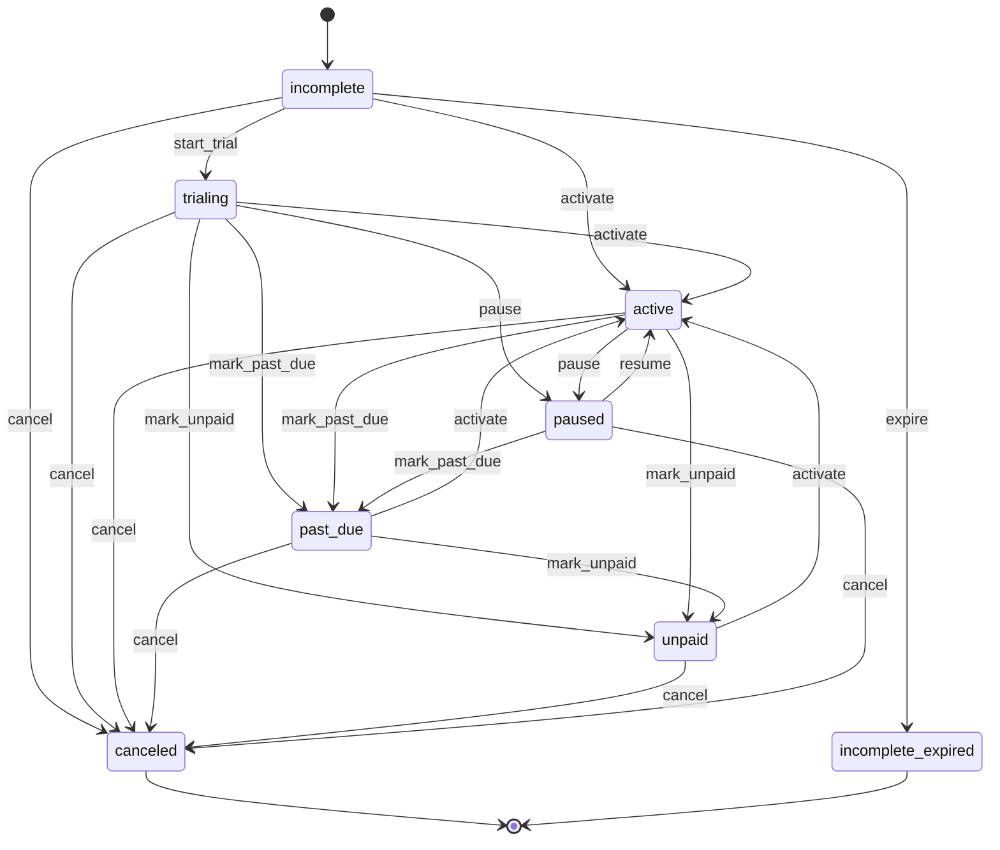
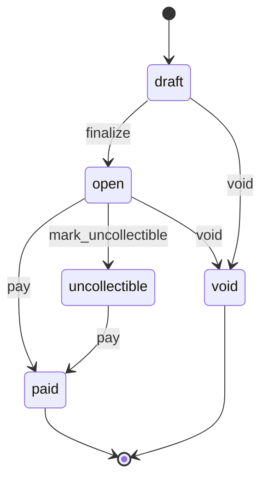
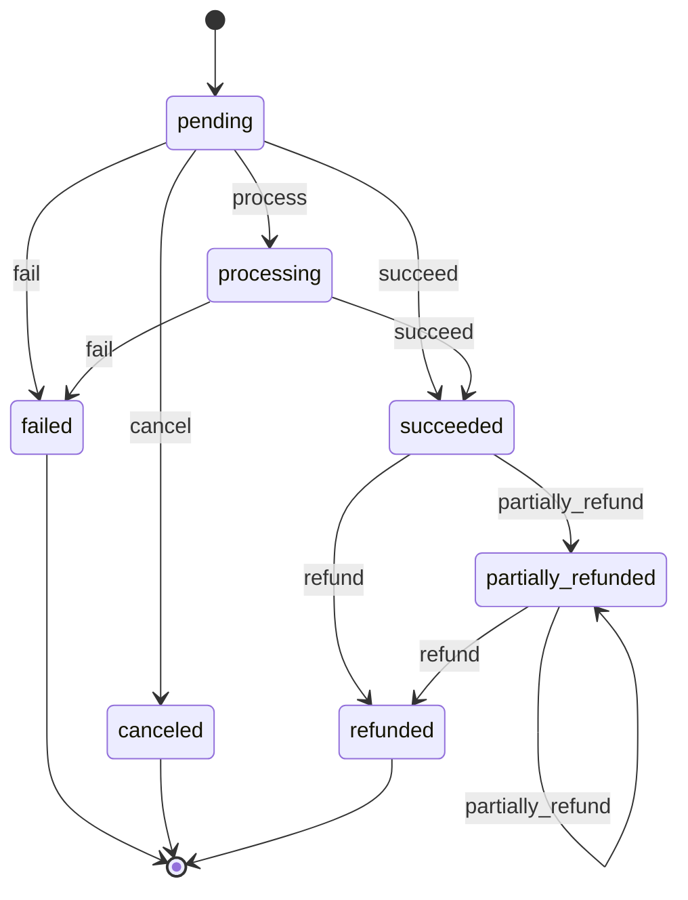
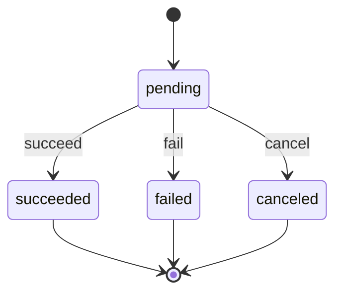

# State Machines

State machines live in `src/domain/states/`. There is one per lifecycle-bearing entity: subscription, invoice, payment, refund. Each machine constrains which status value an entity may move to next and from which current state, so an entity can never reach an illegal status.

## Scope: opt-in helpers, not internal enforcement

These machines are **exported as opt-in helpers** for consumers who want to validate transitions in their own code. They are not a global integrity gate inside the library. The library's own write paths treat the provider as the source of truth and reconcile the provider-reported status directly (see the webhook reconcile path and the subscription actions), so subscription, invoice, and refund status writes do **not** route through `SubscriptionStateMachine` / `InvoiceStateMachine` / `RefundStateMachine`. The one internal use is `PaymentStateMachine` in the refund path, to decide between a full and partial refund transition. If you need transition enforcement over your own status changes, construct the relevant machine and call `can(event)` / the named methods yourself; do not assume the persisted status was gated by it.

## The shared transition mechanism

`src/domain/states/transition.ts` provides the engine that all four machines share.

A `TransitionMap<S, E>` maps each state `S` to a partial record of events `E` and their resulting state:

```ts
export type TransitionMap<S extends string, E extends string> = Partial<
  Record<S, Partial<Record<E, S>>>
>;
```

Two functions operate on a map:

- `applyTransition(machine, map, from, event): S` - looks up `map[from]?.[event]`. If a target state exists, it is returned. If not (the state has no entry, or the event is not allowed from that state), it throws `InvalidStateTransitionError`.
- `canTransition(map, from, event): boolean` - returns `true` if `map[from]?.[event]` is defined, without throwing.

```ts
export function applyTransition(machine, map, from, event) {
  const next = map[from]?.[event];
  if (next === undefined) {
    throw new InvalidStateTransitionError(machine, from, event);
  }
  return next;
}
```

Each machine is a small class wrapping a single `state` field. It exposes:
- `current()` - the present state.
- `can(event)` - delegates to `canTransition`.
- named methods (one per event) - each calls a private `to(event)` that runs `applyTransition` and reassigns `state`, returning `this` for chaining.

### Invalid transitions

`InvalidStateTransitionError` (`src/domain/errors/invalid-state-transition.error.ts`) extends `PayableError`. It is thrown by `applyTransition` whenever the `(from, event)` pair is not in the map. Its message is:

```
Invalid <machine> transition '<event>' from state '<from>'
```

It carries `code: 'INVALID_STATE_TRANSITION'` and a `context` of `{ machine, from, transition }`. A terminal state (one whose map entry is empty or absent) therefore rejects every event. Use `can(event)` to test a transition without triggering the throw.

### Idempotency contract

The machines are strict, not idempotent. There are no self-loops for level events: applying an event whose target equals the current state still throws, because the `(from, event)` pair is absent from the map. For example `succeed` from `succeeded`, `activate` from `active`, `mark_past_due` from `past_due`, and `pay` from `paid` all raise `InvalidStateTransitionError`.

Providers redeliver webhooks, so a caller that drives a machine directly from provider events must treat the machine as at-most-once and guard each call with `can(event)` before applying it (or catch `InvalidStateTransitionError`). A duplicate delivery is then a no-op rather than an error. The library's own webhook path does not rely on the machines for this — it reconciles by writing the provider status directly and dedups redelivery upstream via the webhook claim.

## Subscription

`src/domain/states/subscription-state-machine.ts`. States are the `SubscriptionStatus` values; default initial state is `incomplete`.

Events: `start_trial`, `activate`, `mark_past_due`, `mark_unpaid`, `pause`, `resume`, `cancel`, `expire`.

| From | Event | To |
| --- | --- | --- |
| `incomplete` | `start_trial` | `trialing` |
| `incomplete` | `activate` | `active` |
| `incomplete` | `expire` | `incomplete_expired` |
| `incomplete` | `cancel` | `canceled` |
| `trialing` | `activate` | `active` |
| `trialing` | `mark_past_due` | `past_due` |
| `trialing` | `mark_unpaid` | `unpaid` |
| `trialing` | `pause` | `paused` |
| `trialing` | `cancel` | `canceled` |
| `active` | `mark_past_due` | `past_due` |
| `active` | `mark_unpaid` | `unpaid` |
| `active` | `pause` | `paused` |
| `active` | `cancel` | `canceled` |
| `past_due` | `activate` | `active` |
| `past_due` | `mark_unpaid` | `unpaid` |
| `past_due` | `cancel` | `canceled` |
| `unpaid` | `activate` | `active` |
| `unpaid` | `cancel` | `canceled` |
| `paused` | `resume` | `active` |
| `paused` | `mark_past_due` | `past_due` |
| `paused` | `cancel` | `canceled` |
| `canceled` | - | (terminal: no transitions) |

`incomplete_expired` is reachable but, like `canceled`, has no outgoing transitions (it is absent from the map), so it is terminal.

Methods: `startTrial`, `activate`, `markPastDue`, `markUnpaid`, `pause`, `resume`, `cancel`, `expire`.



```ts
const m = new SubscriptionStateMachine('incomplete');
expect(m.startTrial().current()).toBe('trialing');
expect(m.activate().current()).toBe('active');
expect(m.cancel().current()).toBe('canceled');

expect(new SubscriptionStateMachine('paused').resume().current()).toBe('active');

// canceled is terminal
expect(() => new SubscriptionStateMachine('canceled').resume()).toThrow(InvalidStateTransitionError);
expect(() => new SubscriptionStateMachine('canceled').activate()).toThrow(InvalidStateTransitionError);

// can() probes without throwing
expect(new SubscriptionStateMachine('active').can('cancel')).toBe(true);
expect(new SubscriptionStateMachine('active').can('start_trial')).toBe(false);
```

## Invoice

`src/domain/states/invoice-state-machine.ts`. States are the `InvoiceStatus` values; default initial state is `draft`.

Events: `finalize`, `pay`, `mark_uncollectible`, `void`.

| From | Event | To |
| --- | --- | --- |
| `draft` | `finalize` | `open` |
| `draft` | `void` | `void` |
| `open` | `pay` | `paid` |
| `open` | `mark_uncollectible` | `uncollectible` |
| `open` | `void` | `void` |
| `uncollectible` | `pay` | `paid` |
| `paid` | - | (terminal: no transitions) |
| `void` | - | (terminal: no transitions) |

`paid` and `void` are absent from the map and so are terminal. An `uncollectible` invoice can still be paid.

Methods: `finalize`, `pay`, `markUncollectible`, `voidInvoice`.



```ts
const m = new InvoiceStateMachine('draft');
expect(m.finalize().current()).toBe('open');
expect(m.pay().current()).toBe('paid');

expect(() => new InvoiceStateMachine('draft').pay()).toThrow(InvalidStateTransitionError);
```

A draft invoice cannot be paid directly - it must be `finalize`d to `open` first.

## Payment

`src/domain/states/payment-state-machine.ts`. States are the `PaymentStatus` values; default initial state is `pending`.

Events: `process`, `succeed`, `fail`, `cancel`, `refund`, `partially_refund`.

| From | Event | To |
| --- | --- | --- |
| `pending` | `process` | `processing` |
| `pending` | `succeed` | `succeeded` |
| `pending` | `fail` | `failed` |
| `pending` | `cancel` | `canceled` |
| `processing` | `succeed` | `succeeded` |
| `processing` | `fail` | `failed` |
| `succeeded` | `refund` | `refunded` |
| `succeeded` | `partially_refund` | `partially_refunded` |
| `partially_refunded` | `refund` | `refunded` |
| `partially_refunded` | `partially_refund` | `partially_refunded` |
| `failed` | - | (terminal: no transitions) |
| `canceled` | - | (terminal: no transitions) |
| `refunded` | - | (terminal: no transitions) |

`failed`, `canceled`, and `refunded` are terminal. Refunds are only possible once a payment has `succeeded`; a `partially_refunded` payment can take further partial refunds or be fully `refunded`.

Methods: `process`, `succeed`, `fail`, `cancel`, `refund`, `partiallyRefund`.



```ts
const m = new PaymentStateMachine('pending');
expect(m.process().current()).toBe('processing');
expect(m.succeed().current()).toBe('succeeded');
expect(m.refund().current()).toBe('refunded');

expect(() => new PaymentStateMachine('pending').refund()).toThrow(InvalidStateTransitionError);
```

A pending payment cannot be refunded - it must reach `succeeded` first.

## Refund

`src/domain/states/refund-state-machine.ts`. States are the `RefundStatus` values; default initial state is `pending`.

Events: `succeed`, `fail`, `cancel`.

| From | Event | To |
| --- | --- | --- |
| `pending` | `succeed` | `succeeded` |
| `pending` | `fail` | `failed` |
| `pending` | `cancel` | `canceled` |
| `succeeded` | - | (terminal: no transitions) |
| `failed` | - | (terminal: no transitions) |
| `canceled` | - | (terminal: no transitions) |

Only `pending` has outgoing transitions; all three result states are terminal.

Methods: `succeed`, `fail`, `cancel`.



```ts
expect(new RefundStateMachine('pending').succeed().current()).toBe('succeeded');
expect(() => new RefundStateMachine('succeeded').fail()).toThrow(InvalidStateTransitionError);
```

---

[Previous: Value Objects](06-value-objects.md) · [Index](../00-index.md) · [Next: Customers & Billable](../features/08-customers-billable.md)
