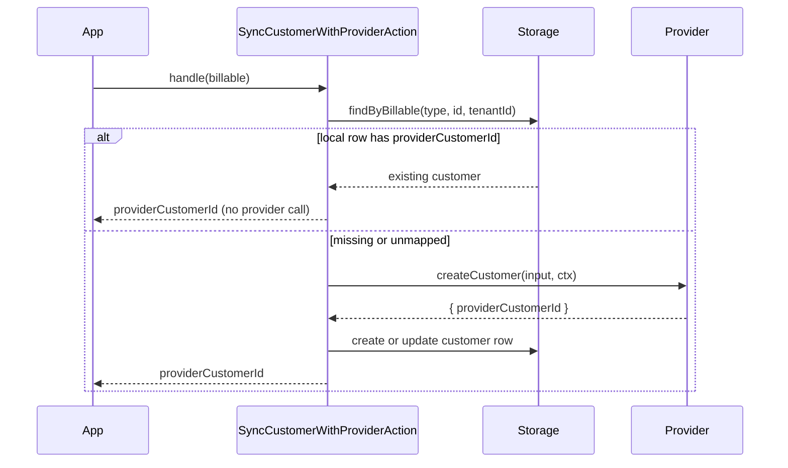

# Customers and the Billable Concept

Every billing operation in Payable starts from a `Billable` - the integrating application's own
record (a user, a team, an organization) that should be billed. Payable never owns that record; it
maps it to a provider customer (a Stripe or Paddle customer) and persists the mapping locally so the
same provider customer is reused across operations.

## The `Billable` shape

Defined in `src/application/builders/billable.ts`:

```ts
export interface Billable {
  billableType: string;
  billableId: string;
  email: string;
  name?: string;
}
```

- `billableType` and `billableId` together identify the application record (for example
  `{ billableType: 'User', billableId: '1' }`). They are the key used to look up and store the local
  customer row.
- `email` is forwarded to the provider when the provider customer is created.
- `name` is optional and forwarded when present.

Payable performs **no ownership check** on the `Billable`. As the overview states, the HTTP adapters
take `billable` straight from the request body; the integrating application is responsible for
authentication and for verifying that the caller owns the `Billable`.

## `CustomerContext` - the entry point

`payable.customer(billable, providerName?, tenantId?)` returns a `CustomerContext`
(`src/application/builders/customer-context.ts`). This is the root of the fluent API: every
customer-scoped operation hangs off it.

```ts
const customer = payable.customer({
  billableType: 'User',
  billableId: '1',
  email: 'user@example.com',
});
```

`CustomerContext` exposes:

| Method | Returns | Covered in |
| --- | --- | --- |
| `newSubscription(name)` | `SubscriptionBuilder` | [09-checkout.md](09-checkout.md), [10-subscriptions.md](10-subscriptions.md) |
| `checkout()` | `CheckoutBuilder` | [09-checkout.md](09-checkout.md) |
| `subscription(name)` | `SubscriptionManager` | [10-subscriptions.md](10-subscriptions.md) |
| `charge(request)` | `Promise<Payment>` | [11-charges-refunds.md](11-charges-refunds.md) |
| `billingPortal(returnUrl)` | `Promise<BillingPortalDTO>` | [12-invoices-portal.md](12-invoices-portal.md) |

### Provider and tenant resolution

`payable.customer(...)` builds a `BillingDependencies` bundle through `Payable.dependencies()`
(`src/payable.ts`):

- **Provider.** If `providerName` is omitted, the first registered provider is used
  (`this.registry.names()[0]`). If no provider is registered, a `ProviderNotFoundError` is thrown.
  With more than one provider registered, pass `providerName` explicitly to avoid binding to whatever
  happens to be first.
- **Tenant.** If tenancy is enabled (`resolved.tenantEnabled`) and `tenantId` is `undefined` or
  `null`, a `PayableError` with code `TENANT_REQUIRED` is thrown. When tenancy is disabled, the
  resolved `tenantId` is `null`. See [16-multi-tenancy.md](16-multi-tenancy.md).

`BillingDependencies` (`src/application/builders/billing-dependencies.ts`):

```ts
export interface BillingDependencies {
  provider: PaymentProvider;
  providerName: string;
  clock: Clock;
  storage?: StorageDriver;
  tenantId?: string | null;
}
```

`storage` is optional, so a `CustomerContext` can be built without a storage driver - but the
operations that need persistence (charge, subscription management, refund) fail explicitly when it is
absent.

## Mapping a local customer to a provider customer

`SyncCustomerWithProviderAction` (`src/application/actions/customers/sync-customer-with-provider.action.ts`)
is the action that turns a `Billable` into a provider customer id. It is invoked internally by
checkout, charge, subscription creation, and the billing portal - never called directly by
application code.

Behavior:

1. If storage is present and a local customer row already exists with a `providerCustomerId`, that id
   is returned immediately. No provider call is made. (The builders test confirms a second checkout
   for the same `Billable` results in only one `createCustomer` call.)
2. Otherwise it calls `provider.createCustomer({ email, name, billableType, billableId }, ctx)` with a
   deterministic idempotency key: `customer:${providerName}:${billableType}:${billableId}`.
3. The returned `providerCustomerId` is persisted: if a local row exists it is updated, otherwise a
   new customer row is created (with `tenantId`, `provider`, `email`, `name`, `metadata: null`).
4. The `providerCustomerId` is returned to the caller.



Without a storage driver the action skips both lookups and the persist step: it always calls
`provider.createCustomer` and returns the id, persisting nothing.

## `CreateCustomerAction`

`src/application/actions/customers/create-customer.action.ts` is a stub. Its `handle()` throws
`PayableError.notImplemented('CreateCustomerAction (Phase 4)')`. Customer creation today happens
implicitly through `SyncCustomerWithProviderAction`; there is no standalone "create customer" path
yet.

## Inputs and outputs

| Concern | Input | Output |
| --- | --- | --- |
| Build a context | `Billable`, optional `providerName`, optional `tenantId` | `CustomerContext` |
| Sync to provider | `Billable` | `Promise<string>` (the `providerCustomerId`) |
| Provider create payload | `CreateCustomerInput` (`{ email, name?, billableType, billableId, metadata? }`) | `CustomerDTO` (`{ providerCustomerId, email, name }`) |

## Edge cases

- **No provider registered.** `payable.customer(...)` throws `ProviderNotFoundError`.
- **Multiple providers.** Without an explicit `providerName`, the first registered provider is used;
  pass the name to be deterministic.
- **Tenancy enabled, no tenant id.** `payable.customer(...)` throws `PayableError`
  (`TENANT_REQUIRED`).
- **No storage driver.** Sync still calls the provider on every invocation and persists nothing, so
  the same `Billable` produces a fresh provider call each time rather than reusing a stored id.
- **Re-sync after a row exists but has no `providerCustomerId`.** The action creates the provider
  customer and updates the existing row in place rather than inserting a duplicate.

---

[Previous: State Machines](../domain/07-state-machines.md) · [Index](../00-index.md) · [Next: Checkout](09-checkout.md)
