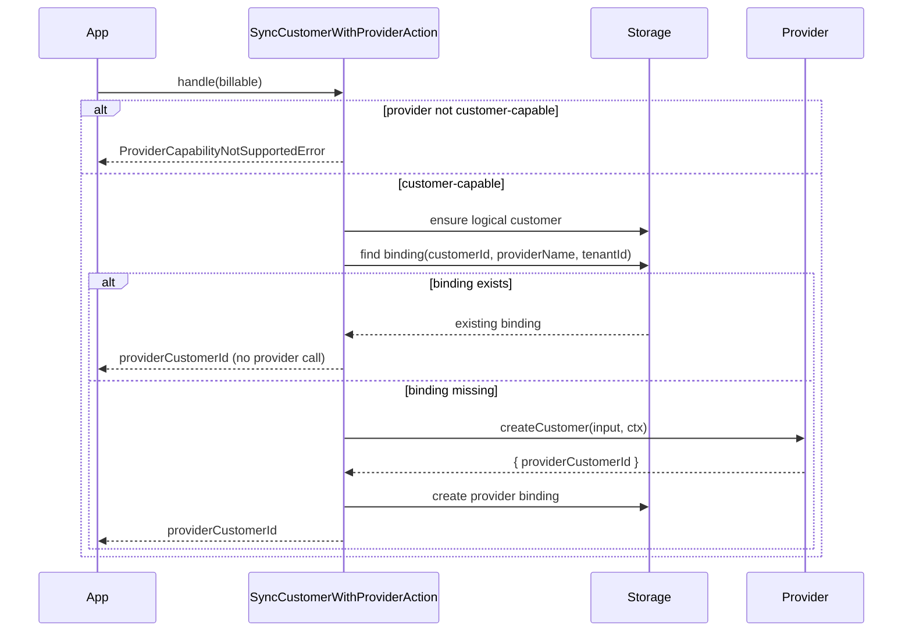

# Customers and the Billable Concept

Every billing operation in Payable starts from a `Billable` - the integrating application's own
record (a user, a team, an organization) that should be billed. Payable never owns that record. It
persists one provider-neutral `Customer` and maps that customer to zero or more provider accounts
through `CustomerProviderBinding` records.

Whether a provider customer is created depends on the provider's `customers` capability:

- **Provider with `customers`** (Stripe, Paddle): `payable.customers(providerName).create(...)`
  ensures the logical customer, provisions the provider customer once, and stores the returned id in
  a binding keyed by the registered provider name.
- **Provider without `customers`** (SISP): Payable creates only the logical customer, so the billable
  can still own payments. `binding(...)` returns `null`, and `update(...)` edits the local record.

The registered provider name is the account boundary. For example, `stripe-eu` and `stripe-us` may
use the same adapter type while retaining independent customer identities.

```ts
const customer = await payable.customers('stripe').create(billable);
await payable.customers('paddle').create(billable);

const stripeBinding = await payable.customers('stripe').binding(billable);
const paddleBinding = await payable.customers('paddle').binding(billable);

customer.id; // one stable local id
stripeBinding?.providerCustomerId; // e.g. cus_...
paddleBinding?.providerCustomerId; // e.g. ctm_...
```

## Migrating from beta3

This changes the public `Customer` shape. Code that read `customer.provider` or
`customer.providerCustomerId` must select the registered provider and read its binding:

```ts
const customer = await payable.customers('stripe').get(billable);
const binding = await payable.customers('stripe').binding(billable);

binding?.provider;
binding?.providerCustomerId;
```

Run `migrate(knex)` before starting the updated application. Migration
`008-customer-provider-bindings` backfills non-null beta3 provider ids into bindings and removes the
legacy columns only after verifying the backfill.

Prisma users must edit the generated migration instead of accepting a direct drop of `provider` and
`provider_customer_id`. Use an expand/backfill/contract migration:

1. Add `tenant_key` to `payable_customers` with `NOT NULL DEFAULT ''`, populate it with
   `COALESCE(tenant_id, '')`, and add the unique index from `prisma/models.prisma`.
2. Create `payable_customer_provider_bindings` using Prisma's generated DDL, but retain both legacy
   customer columns.
3. Backfill the beta3 identity before any drop. A beta3 customer has at most one provider identity,
   so its customer id is also a collision-free binding id:

```sql
INSERT INTO payable_customer_provider_bindings
  (id, customer_id, provider, provider_customer_id, created_at, updated_at)
SELECT id, id, provider, provider_customer_id, created_at, updated_at
FROM payable_customers
WHERE provider_customer_id IS NOT NULL;
```

4. Verify that this query returns zero rows:

```sql
SELECT customer.id
FROM payable_customers AS customer
LEFT JOIN payable_customer_provider_bindings AS binding
  ON binding.customer_id = customer.id
 AND binding.provider = customer.provider
 AND binding.provider_customer_id = customer.provider_customer_id
WHERE customer.provider_customer_id IS NOT NULL
  AND binding.id IS NULL;
```

5. Only after verification, drop the old unique constraint and the two legacy columns. If an
   interrupted migration may be rerun, use `ON CONFLICT (customer_id, provider) DO NOTHING` on
   PostgreSQL/SQLite or `INSERT IGNORE` on MySQL for the backfill statement.

## The `Billable` shape

```ts
export interface Billable {
  billableType: string;
  billableId: string;
  email: string;
  name?: string;
}
```

- `billableType` and `billableId` together identify the application record (for example
  `{ billableType: 'User', billableId: '1' }`). They are the key used to look up and store the local
  customer row.
- `email` is forwarded to the provider when the provider customer is created.
- `name` is optional and forwarded when present.

Payable performs **no ownership check** on the `Billable`. The HTTP adapters take `billable` straight
from the request body; the integrating application is responsible for authentication and for verifying
that the caller owns the `Billable`.

## `CustomerContext` - the entry point

`payable.customer(billable, providerName?, tenantId?)` returns a `CustomerContext`. This is the root
of the fluent API: every customer-scoped operation hangs off it.

```ts
const customer = payable.customer({
  billableType: 'User',
  billableId: '1',
  email: 'user@example.com',
});
```

`CustomerContext` exposes:

| Method | Returns | Covered in |
| --- | --- | --- |
| `newSubscription(name)` | `SubscriptionBuilder` | [09-checkout.md](09-checkout.md), [10-subscriptions.md](10-subscriptions.md) |
| `checkout()` | `CheckoutBuilder` | [09-checkout.md](09-checkout.md) |
| `redirectCheckout(amount: Money)` | `RedirectCheckoutBuilder` | [09-checkout.md](09-checkout.md) |
| `subscription(name)` | `SubscriptionManager` | [10-subscriptions.md](10-subscriptions.md) |
| `charge(request)` | `Promise<Payment>` | [11-charges-refunds.md](11-charges-refunds.md) |
| `invoices(limit?)` | `Promise<InvoiceDTO[]>` | [12-invoices-portal.md](12-invoices-portal.md) |
| `payments(options?: ListOptions)` | `Promise<Payment[]>` | [11-charges-refunds.md](11-charges-refunds.md) |
| `subscriptions(options?: ListOptions)` | `Promise<Subscription[]>` | [10-subscriptions.md](10-subscriptions.md) |
| `billingPortal(returnUrl)` | `Promise<BillingPortalDTO>` | [12-invoices-portal.md](12-invoices-portal.md) |

### Provider and tenant resolution

`payable.customer(...)` builds a `BillingDependencies` bundle through `Payable.dependencies()`:

- **Provider.** If `providerName` is omitted, the first registered provider is used
  (`this.registry.names()[0]`). If no provider is registered, a `ProviderNotFoundError` is thrown.
  With more than one provider registered, pass `providerName` explicitly to avoid binding to whatever
  happens to be first.
- **Tenant.** If tenancy is enabled (`resolved.tenantEnabled`) and `tenantId` is `undefined` or
  `null`, a `PayableError` with code `TENANT_REQUIRED` is thrown. When tenancy is disabled, the
  resolved `tenantId` is `null`. See [16-multi-tenancy.md](16-multi-tenancy.md).

`BillingDependencies`:

```ts
export interface BillingDependencies {
  provider: PaymentProvider;
  providerName: string;
  clock: Clock;
  storage?: StorageDriver;
  tenantId?: string | null;
  authorizationEnabled?: boolean;
  idempotency?: IdempotencyService;
  logger?: Logger;
}
```

`storage` is optional, so a `CustomerContext` can be built without a storage driver - but the
operations that need persistence (charge, subscription management, refund) fail explicitly when it is
absent.

## Mapping a logical customer to provider accounts

`SyncCustomerWithProviderAction` turns a `Billable` into a provider customer id. It is invoked
internally by checkout, charge, subscription creation, and the billing portal - never called directly
by application code.

Behavior:

1. `EnsureCustomerAction` finds or creates the logical customer by
   `(tenantId, billableType, billableId)`.
2. `SyncCustomerWithProviderAction` requires the selected provider's `customers` capability.
3. It looks for a binding by `(customerId, providerName)`. If one exists, its provider id is returned
   without a provider call.
4. Otherwise it calls `provider.createCustomer(...)` with a deterministic idempotency key containing
   the registered provider name.
5. It persists a `CustomerProviderBinding`. A concurrent insert that selected the same provider id is
   treated as success; a different winning id raises `CUSTOMER_PROVIDER_BINDING_CONFLICT`. A provider
   customer that cannot be bound raises `CUSTOMER_PROVIDER_BINDING_PERSISTENCE_FAILED`.


```mermaid
sequenceDiagram
    participant App
    participant Sync as SyncCustomerWithProviderAction
    participant Storage
    participant Provider
    App->>Sync: handle(billable)
    alt provider not customer-capable
        Sync-->>App: ProviderCapabilityNotSupportedError
    else customer-capable
        Sync->>Storage: ensure logical customer
        Sync->>Storage: find binding(customerId, providerName, tenantId)
        alt binding exists
            Storage-->>Sync: existing binding
            Sync-->>App: providerCustomerId (no provider call)
        else binding missing
            Sync->>Provider: createCustomer(input, ctx)
            Provider-->>Sync: { providerCustomerId }
            Sync->>Storage: create provider binding
            Sync-->>App: providerCustomerId
        end
    end
```

Without a storage driver the action skips both lookups and the persist step: once the provider is
confirmed customer-capable it calls `provider.createCustomer` and returns the id, persisting nothing.

## Inputs and outputs

| Concern | Input | Output |
| --- | --- | --- |
| Build a context | `Billable`, optional `providerName`, optional `tenantId` | `CustomerContext` |
| Ensure/select a customer | `payable.customers(providerName).create(Billable)` | `Promise<Customer>` (provider-neutral) |
| Read the selected binding | `payable.customers(providerName).binding(Billable)` | `Promise<CustomerProviderBinding \| null>` |
| Sync to provider | `Billable` | `Promise<string>` (the `providerCustomerId`) |
| Provider create payload | `CreateCustomerInput` (`{ email, name?, billableType, billableId, metadata? }`) | `CustomerDTO` (`{ providerCustomerId, email, name }`) |

## Edge cases

- **No provider registered.** `payable.customer(...)` throws `ProviderNotFoundError`.
- **Multiple providers.** Without an explicit `providerName`, the first registered provider is used;
  pass the name to be deterministic.
- **Tenancy enabled, no tenant id.** `payable.customer(...)` throws `PayableError`
  (`TENANT_REQUIRED`).
- **No storage driver.** Sync still calls the provider on every invocation and persists nothing, so
  the same `Billable` produces a fresh provider call each time rather than reusing a stored id.
- **A new provider for an existing customer.** The logical customer is reused and only a new binding
  is added.
- **Two accounts of the same provider type.** Register them under distinct keys such as `stripe-eu`
  and `stripe-us`; bindings use those keys, not `provider.name`.
- **Provider without customer support.** `CustomerResource.create` stores the logical customer and
  creates no binding.

---

[Previous: State Machines](../domain/07-state-machines.md) · [Index](../00-index.md) · [Next: Checkout](09-checkout.md)
