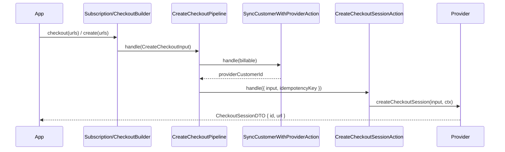

# Checkout

Checkout produces a provider-hosted checkout session that the application redirects the customer to.
Payable supports two modes: **subscription** checkout (start a subscription through the hosted page)
and **payment** checkout (a one-time payment). Both run through one pipeline and return the same DTO.

## Two builders, two entry points

### Subscription-mode checkout - `newSubscription(name).checkout(urls)`

`SubscriptionBuilder` is reached via `payable.customer(billable).newSubscription(name)`. Its
`checkout()` method builds a `subscription`-mode session. The same builder can instead `create()` a
subscription directly without a hosted page - see [10-subscriptions.md](10-subscriptions.md).

Fluent options on `SubscriptionBuilder`:

| Method | Effect |
| --- | --- |
| `price(priceId)` | Sets the primary price (required before `checkout()`). |
| `trialDays(days)` | Adds a trial; forwarded as `trialDays`. |
| `coupon(code)` | Applies a coupon; forwarded as `coupon`. |
| `quantity(n)` | Sets the primary line-item quantity (default `1`). |
| `addItem(priceId, qty)` | Adds extra line items - used by `create()`, not by `checkout()`. |

`checkout(request)` takes a `CheckoutRequest` (`{ successUrl, cancelUrl }`) and:

1. Throws `PayableError` (`CHECKOUT_PRICE_REQUIRED`) if no price was set.
2. Delegates to `CreateCheckoutPipeline` with `mode: 'subscription'`, a single line item
   `{ priceId, quantity }`, the URLs, the `subscriptionName`, and the optional `trialDays`/`coupon`.

Note: in subscription-mode checkout, only the primary price becomes the line item - `addItem(...)`
entries are not forwarded by `checkout()` (they apply to direct `create()`).

```ts
const session = await payable
  .customer(billable)
  .newSubscription('default')
  .price('price_pro')
  .trialDays(14)
  .checkout({
    successUrl: 'https://app.test/success',
    cancelUrl: 'https://app.test/cancel',
  });

return redirect(session.url);
```

### Payment-mode checkout - `checkout()`

`CheckoutBuilder` is reached via `payable.customer(billable).checkout()`. It defaults to
`mode: 'payment'`.

| Method | Effect |
| --- | --- |
| `mode(mode)` | `'payment'` or `'subscription'` (default `'payment'`). |
| `addPrice(priceId, qty)` | Appends a line item (default qty `1`). At least one is required. |
| `create(request)` | Builds the session; throws `CHECKOUT_LINE_ITEMS_REQUIRED` if no line items. |

`CheckoutBuilder` does not accept `trialDays` or `coupon`; those are only set through the
subscription builder. Its `subscriptionName` is fixed to `'default'`.

```ts
const session = await payable
  .customer(billable)
  .checkout()
  .mode('payment')
  .addPrice('price_one')
  .create({
    successUrl: 'https://app.test/success',
    cancelUrl: 'https://app.test/cancel',
  });
```

### Redirect/amount checkout - `redirectCheckout(amount)`

Catalog-less providers (SISP) have no prices, so the `checkout()`/`create()` builders (which require
line items and a provider customer) do not fit. `payable.customer(billable).redirectCheckout(amount)`
is a separate, amount-based entry for hosted-redirect providers:

| Method | Effect |
| --- | --- |
| `redirectCheckout(amount: Money)` | Starts an amount-based, payment-mode redirect checkout. |
| `create(request)` | Ensures a local customer, records a pending `Payment`, and returns the session. |

```ts
const session = await payable
  .customer(billable)
  .redirectCheckout(Money.of(150000, 'CVE'))
  .create({ reference: 'order-42' });

res.send(session.html); // hosted-form providers return a ready auto-submit form
```

Unlike the catalog pipeline it does not call the provider customer sync (the provider may have no
`customers` capability); it ensures a local customer, then records a pending `Payment` keyed by the
session id so the later callback can reconcile it. The provider-specific callback is processed with
`payable.receiveRedirectCallback(...)`. See [SISP](../integrations/20-sisp.md).

### The `CheckoutSessionDTO`

`CheckoutSessionDTO` is `{ id, url, html? }`. Stripe and Paddle return `id` + `url` (a hosted page to
redirect to). Redirect-form providers (SISP) additionally return `html` - a ready auto-submit form to
send to the browser, which POSTs to the gateway in `url`.

## The pipeline and action

`CreateCheckoutPipeline` (the catalog `checkout()` path) composes two steps:

1. **Sync the customer.** `SyncCustomerWithProviderAction` resolves (and persists) the
   `providerCustomerId` for the `Billable` - see [08-customers-billable.md](08-customers-billable.md).
2. **Create the session.** `CreateCheckoutSessionAction` calls
   `provider.createCheckoutSession(input, ctx)`.

The pipeline builds a deterministic idempotency key with `IdempotencyKey.forCheckout`:
`checkout:${providerName}:${billableType}:${billableId}:${firstPriceId}:${subscriptionName}`. Repeated
calls with the same `Billable`, first price, and subscription name reuse the key.



## Inputs and outputs

The provider receives `CreateCheckoutSessionInput`:

```ts
export interface CreateCheckoutSessionInput {
  providerCustomerId: string;
  mode: 'payment' | 'subscription';
  lineItems: { priceId: string; quantity: number }[];
  successUrl: string;
  cancelUrl: string;
  trialDays?: number;
  coupon?: string;
  amount?: Money;
}
```

The output is a `CheckoutSessionDTO`:

```ts
export interface CheckoutSessionDTO {
  id: string;
  url: string;
}
```

The application redirects the customer to `url`. The actual subscription or payment record is created
locally later, when the provider's webhook is received and reconciled - see
[13-webhooks.md](13-webhooks.md).

## Business rules

- Subscription-mode checkout requires a price (`CHECKOUT_PRICE_REQUIRED`).
- Payment-mode checkout requires at least one line item (`CHECKOUT_LINE_ITEMS_REQUIRED`).
- The customer is always synced to the provider before the session is created.
- `trialDays` and `coupon` flow only through the subscription builder.
- The provider's `checkout` capability is not asserted in the checkout path itself; the pipeline
  assumes the bound provider supports `createCheckoutSession` (it is a required method on the
  `PaymentProvider` contract).

## Policy

`CanCreateCheckoutPolicy` authorizes against an `AuthorizationContext` (`allowed === true` and a
non-empty `actorId`). It is **not yet wired into the checkout pipeline or builders** - no checkout code
references it. Treat it as an available building block for integrators, not an enforced gate. See
[11-charges-refunds.md](11-charges-refunds.md) for the same status across the other CRUD policies.

## Edge cases

- **No price / no line items.** Explicit `PayableError`s as above.
- **`addItem` in subscription checkout.** Ignored by `checkout()`; only the primary price is sent.
  Multi-item plans go through `create()` (direct subscription).
- **Tenancy / provider resolution.** Inherited from `payable.customer(...)` - see
  [08-customers-billable.md](08-customers-billable.md).
- **Idempotent retries.** Re-issuing the same checkout reuses the deterministic key, so the provider
  can dedupe the session.

---

[Previous: Customers and Billable](08-customers-billable.md) · [Index](../00-index.md) · [Next: Subscriptions](10-subscriptions.md)
