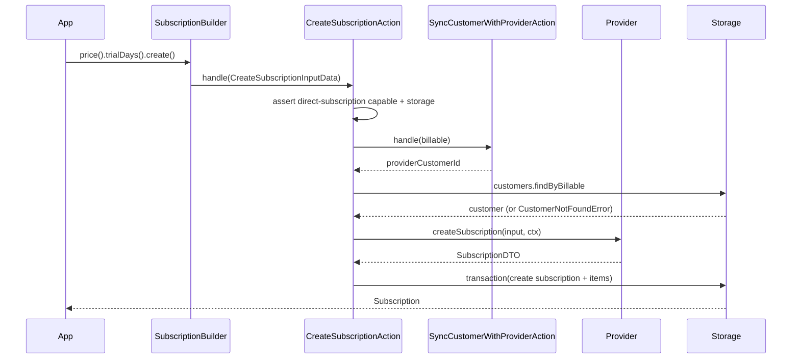

# Subscriptions

Payable manages the full subscription lifecycle: create, swap the price, change quantity, cancel at
period end (grace period), cancel immediately, and resume. Creation runs through a builder; all
post-creation operations run through a manager. Every operation persists the new state locally after
the provider confirms it.

## Two entry points

| Goal | Entry point | Class |
| --- | --- | --- |
| Create a subscription | `payable.customer(billable).newSubscription(name)` | `SubscriptionBuilder` |
| Manage an existing one | `payable.customer(billable).subscription(name)` | `SubscriptionManager` |

The `name` is the local subscription name (for example `'default'`). It scopes the subscription per
customer: `FindSubscriptionQuery` looks it up with `storage.subscriptions.findByName(customerId, name)`.

## Creating a subscription

`SubscriptionBuilder` (`src/application/builders/subscription-builder.ts`) collects state fluently,
then `create()` runs `CreateSubscriptionAction`.

| Method | Effect |
| --- | --- |
| `price(priceId)` | Primary price. Required before `create()`. |
| `addItem(priceId, qty)` | Extra line item (default qty `1`). |
| `trialDays(days)` | Trial length. |
| `coupon(code)` | Coupon code. |
| `quantity(qty)` | Primary line-item quantity (default `1`). |

```ts
const subscription = await payable
  .customer(billable)
  .newSubscription('default')
  .price('price_pro')
  .trialDays(14)
  .coupon('LAUNCH')
  .addItem('price_seats', 5)
  .create();
```

`CreateSubscriptionAction` (`src/application/actions/subscriptions/create-subscription.action.ts`):

1. Requires the provider to be **direct-subscription capable** (`isDirectSubscriptionCapable`,
   i.e. it implements `createSubscription`); otherwise throws
   `ProviderCapabilityNotSupportedError`.
2. Requires a storage driver (inherited from `SubscriptionAction.storage()`,
   `SUBSCRIPTION_STORAGE_REQUIRED`).
3. Syncs the customer to the provider (`SyncCustomerWithProviderAction`) and loads the local customer
   row; throws `CustomerNotFoundError` if missing.
4. Calls `provider.createSubscription({ providerCustomerId, priceId, quantity, items, trialDays, coupon }, ctx)`
   with key `IdempotencyKey.forSubscription` (`subscription:create:...` keyed by billable + name + price).
5. In a storage transaction, persists the `subscriptions` row and one `subscription_items` row per
   line item. When `addItem(...)` was used, the items array is the primary price followed by the
   additional items; otherwise it is a single primary item.

The persisted subscription captures `status`, `priceId`, `quantity` (default `1`), `trialEndsAt`, and
`currentPeriodEnd` from the provider DTO; `endsAt` and `currentPeriodStart` start as `null`.



`SubscriptionBuilder` can alternatively call `checkout(urls)` to start the subscription through a
provider-hosted page instead of creating it directly - see [09-checkout.md](09-checkout.md).

## Managing a subscription

`SubscriptionManager` (`src/application/builders/subscription-manager.ts`) wraps one action per
operation. They all extend `SubscriptionAction`
(`src/application/actions/subscriptions/subscription-action.ts`), which:

- requires a storage driver (`SUBSCRIPTION_STORAGE_REQUIRED`),
- asserts the provider's `subscriptions` capability via `assertProviderCapability`,
- resolves the local subscription by name (`SubscriptionNotFoundError` if missing or unmapped),
- builds a deterministic idempotency key per operation
  (`subscription:${operation}:${providerName}:${providerSubscriptionId}[:discriminator]`).

### Swap - `subscription(name).swap(priceId)`

`SwapSubscriptionAction` calls `provider.updateSubscription({ providerSubscriptionId, priceId })`,
then updates the local `priceId` and `status`, and updates the primary subscription item's price.
Use to move a customer between plans.

### Update quantity - `subscription(name).updateQuantity(qty)`

`UpdateSubscriptionQuantityAction` calls `provider.updateSubscription({ providerSubscriptionId, quantity })`,
then updates the local `quantity` and `status` and the primary item's quantity. The idempotency key
includes the quantity as a discriminator, so each distinct quantity gets its own key.

### Cancel (grace period) - `subscription(name).cancel()`

`CancelSubscriptionAction` calls `provider.cancelSubscription({ providerSubscriptionId, immediately: false })`,
then sets the local `status` and `endsAt = dto.currentPeriodEnd`. The subscription stays usable until
that date - this is the **grace period**. `onGracePeriod(subscription, now)`
(`src/domain/entities/subscription-state.ts`) returns `true` while `endsAt` is in the future.

### Cancel now - `subscription(name).cancelNow()`

`CancelSubscriptionNowAction` calls `cancelSubscription({ ..., immediately: true })`, then sets
`status` and `endsAt = clock.now()`. There is no grace period; the subscription ends immediately. In
the lifecycle test the canceled-now subscription has `status: 'canceled'` and `endsAt` equal to the
current clock time.

### Resume - `subscription(name).resume()`

`ResumeSubscriptionAction` calls `provider.resumeSubscription({ providerSubscriptionId })`, then sets
`status` and clears `endsAt = null`. Resuming is meaningful for a subscription that was canceled with
grace (still within its period); clearing `endsAt` takes it back off the grace period. The lifecycle
test resumes a grace-period subscription and asserts `endsAt` becomes `null`.

```ts
const manager = payable.customer(billable).subscription('default');

await manager.swap('price_business');
await manager.updateQuantity(3);
await manager.cancel();      // ends at period end (grace period)
await manager.resume();      // clears endsAt
await manager.cancelNow();   // ends immediately
```

## Cancel vs cancel-now vs resume

| Operation | Provider call | Local `endsAt` | Customer access |
| --- | --- | --- | --- |
| `cancel()` | `immediately: false` | `currentPeriodEnd` | Retained until period end (grace) |
| `cancelNow()` | `immediately: true` | `clock.now()` | Ends immediately |
| `resume()` | `resumeSubscription` | `null` | Restored |

## State helpers

`src/domain/entities/subscription-state.ts` provides pure predicates over a stored subscription:

- `onTrial(subscription, now)` - `trialEndsAt` in the future.
- `onGracePeriod(subscription, now)` - `endsAt` in the future.
- `subscriptionEnded(subscription, now)` - `endsAt` in the past or now.

For the underlying status transitions (`trialing`, `active`, `canceled`, …) see
[07-state-machines.md](../domain/07-state-machines.md).

## Policies

`CanCreateSubscriptionPolicy`, `CanCancelSubscriptionPolicy`, and `CanResumeSubscriptionPolicy`
(`src/application/policies/*.ts`) authorize against an `AuthorizationContext`. As of this version they
are **not wired into the subscription actions** - no action references them. They are available
building blocks; integrators enforce authorization in their own layer. (Only
`CanReplayWebhookPolicy` is actually used by an action - see [13-webhooks.md](13-webhooks.md).)

## Edge cases

- **No storage driver.** Any management operation throws `PayableError` (`...requires a storage driver`).
  Verified by the "rejects management without storage" test.
- **Provider lacks `subscriptions` capability.** `assertProviderCapability` throws
  `ProviderCapabilityNotSupportedError`. Verified by the capability test.
- **Provider not direct-subscription capable on create.** `CreateSubscriptionAction` throws before any
  provider call.
- **Unknown subscription name.** `resolve()` throws `SubscriptionNotFoundError`.
- **Customer row missing on create.** `CustomerNotFoundError` after sync (defensive; sync normally
  creates the row).
- **Subscription-mode checkout vs direct create.** `newSubscription(...).checkout(urls)` forwards only
  the primary price; multi-item plans need `create()` with `addItem(...)`.

---

[Previous: Checkout](09-checkout.md) · [Index](../00-index.md) · [Next: Charges and Refunds](11-charges-refunds.md)
