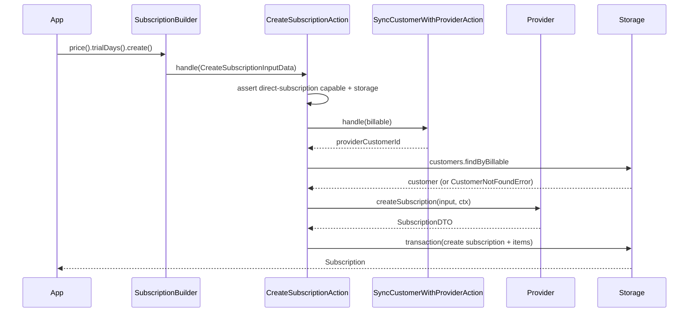

# Subscriptions

Payable manages the full subscription lifecycle: create, swap the price, change quantity, cancel at
period end (grace period), cancel immediately, and resume. Creation runs through a builder; all
post-creation operations run through a manager. Every operation persists the new state locally after
the provider confirms it.

## Three entry points

| Goal | Entry point | Class |
| --- | --- | --- |
| Create a provider-independent subscription | `payable.canonicalSubscriptions().create(input)` | `CanonicalSubscriptionResource` |
| Create a subscription | `payable.customer(billable).newSubscription(name)` | `SubscriptionBuilder` |
| Manage an existing one | `payable.customer(billable).subscription(name)` | `SubscriptionManager` |

The `name` is the local subscription name (for example `'default'`). It scopes the subscription per
customer: `FindSubscriptionQuery` looks it up with `storage.subscriptions.findByName(customerId, name)`.

## Creating a canonical subscription

A canonical subscription is a local recurring agreement. It does not require a registered provider,
provider credentials, a checkout session, or a provider price ID. The logical customer and active
recurring canonical price must belong to the same tenant.

```ts
const subscription = await payable.canonicalSubscriptions(tenantId).create({
  customerId: customer.id,
  name: 'default',
  priceId: price.id,
  quantity: 3,
  activation: { state: 'pending' },
  collectionResponsibility: 'merchant',
  source: 'api',
});
```

Use `activation: { state: 'active', startsAt }` to activate at a known instant. Payable derives the
next renewal boundary from the accepted recurring interval. A trial requires explicit `startsAt` and
`trialEndsAt` values. Payable rejects an end that is not after the start and never infers that a
payment was collected.

Creation snapshots the canonical price ID, currency, unit amount, interval, interval count, and
quantity. Archiving or replacing the price does not rewrite these accepted terms. Exact retries for
the same `(tenant, customer, name)` identity return the existing local subscription. Changed terms
for that identity return `SUBSCRIPTION_IDENTITY_CONFLICT`.

Attach a remote identity later without replacing the local ID or accepted terms:

```ts
await payable.canonicalSubscriptions(tenantId).attachProvider(subscription.id, {
  provider: 'stripe',
  providerSubscriptionId: 'sub_123',
});
```

`payable.subscription(localId, tenantId).retrieve()` remains local and works without a binding.
Provider mutations require one matching binding and fail with
`SUBSCRIPTION_PROVIDER_BINDING_REQUIRED` before resolving or calling an adapter. Multiple bindings
return `SUBSCRIPTION_PROVIDER_BINDING_AMBIGUOUS` unless the caller selects one with
`payable.subscription(localId, tenantId, providerName)`.

Use `await payable.subscription(localId, tenantId).capabilities()` to inspect local record
capabilities independently from the operation capabilities of each configured provider binding.

## Listing canonical subscriptions and stored payments

Administrative collection reads use local storage only. They do not resolve a provider or inspect
provider capabilities.

```ts
const subscriptions = await payable.canonicalSubscriptions(tenantId).list({
  status: 'active',
  customerId,
  limit: 25,
});

const payments = await payable.storedPayments(tenantId).list({
  currency: 'EUR',
  reference: 'transfer-',
  limit: 25,
});

const subscription = await payable
  .canonicalSubscriptions(tenantId)
  .retrieve(subscriptionId);
const payment = await payable.storedPayments(tenantId).retrieve(paymentId);
```

Both lists return `{ items, nextCursor, hasMore }`, default to 25 records, and reject limits above
100. Subscription filters support exact `id`, `customerId`, `status`, `canonicalPriceId`,
`canonicalProductId`, and `name`. `canonicalProductId` is the immutable product associated with
the accepted canonical price; provider identifiers and current catalogue defaults are never used
to derive it. Payment filters support exact `id`, `customerId`, `status`, and `currency`, plus
case-insensitive substring searches for `reference` and `description`.

Set `includeBindings: true` on canonical subscription pages to include safe provider binding
identifiers and synchronization timestamps. Existing `payable.subscriptions(tenantId, options)` and
`payable.payments(tenantId, options)` methods remain available and continue returning arrays for
compatibility.

## Creating a provider-owned subscription

`SubscriptionBuilder` collects state fluently, then `create()` runs `CreateSubscriptionAction`.

| Method | Effect |
| --- | --- |
| `price(priceId)` | Primary price. Required before `create()`. |
| `addItem(priceId, qty)` | Extra line item (default qty `1`). |
| `trialDays(days)` | Trial length. |
| `coupon(code)` | Coupon code. |
| `quantity(qty)` | Primary line-item quantity (default `1`). |

```ts
const subscription = await payable
  .customer(billable)
  .newSubscription('default')
  .price('price_pro')
  .trialDays(14)
  .coupon('LAUNCH')
  .addItem('price_seats', 5)
  .create();
```

`CreateSubscriptionAction`:

1. Requires the provider to be **direct-subscription capable** (`isDirectSubscriptionCapable`,
   i.e. it implements `createSubscription`); otherwise throws
   `ProviderCapabilityNotSupportedError`.
2. Requires a storage driver (inherited from `SubscriptionAction.storage()`,
   `SUBSCRIPTION_STORAGE_REQUIRED`).
3. Syncs the customer to the provider (`SyncCustomerWithProviderAction`) and loads the local customer
   row; throws `CustomerNotFoundError` if missing.
4. Calls `provider.createSubscription({ providerCustomerId, priceId, quantity, items, trialDays, coupon }, ctx)`
   with key `IdempotencyKey.forSubscription` (`subscription:create:...` keyed by billable + name + price).
5. In a storage transaction, persists the `subscriptions` row and one `subscription_items` row per
   line item. When `addItem(...)` was used, the items array is the primary price followed by the
   additional items; otherwise it is a single primary item.

The persisted subscription captures `status`, `priceId`, `quantity` (default `1`), `trialEndsAt`, and
`currentPeriodEnd` from the provider DTO; `endsAt` and `currentPeriodStart` start as `null`.


```mermaid
sequenceDiagram
    participant App
    participant Builder as SubscriptionBuilder
    participant Action as CreateSubscriptionAction
    participant Sync as SyncCustomerWithProviderAction
    participant Provider
    participant Storage
    App->>Builder: price().trialDays().create()
    Builder->>Action: handle(CreateSubscriptionInputData)
    Action->>Action: assert direct-subscription capable + storage
    Action->>Sync: handle(billable)
    Sync-->>Action: providerCustomerId
    Action->>Storage: customers.findByBillable
    Storage-->>Action: customer (or CustomerNotFoundError)
    Action->>Provider: createSubscription(input, ctx)
    Provider-->>Action: SubscriptionDTO
    Action->>Storage: transaction(create subscription + items)
    Storage-->>App: Subscription
```

`SubscriptionBuilder` can alternatively call `checkout(urls)` to start the subscription through a
provider-hosted page instead of creating it directly - see [09-checkout.md](09-checkout.md).

## Managing a subscription

`SubscriptionManager.get()` returns the stored subscription (`Subscription | null`) by name via
`FindSubscriptionQuery`, without touching the provider. Price and quantity changes require explicit
effective-timing, proration, and payment-failure policies. Options without `itemId` target the only
local item. Multi-item subscriptions require the local item ID and reject ambiguous mutations.

`SubscriptionManager` wraps one action per operation. They all extend `SubscriptionAction`, which:

- requires a storage driver (`SUBSCRIPTION_STORAGE_REQUIRED`),
- asserts the provider's coarse `subscriptions` capability and the requested granular operation,
- resolves the local subscription by name (`SubscriptionNotFoundError` if missing or unmapped),
- builds a deterministic idempotency key per operation
  (`subscription:${operation}:${providerName}:${providerSubscriptionId}[:discriminator]`).

### Manage by local ID

Use the local subscription ID returned by list operations for administrative workflows:

```ts
const subscription = payable.subscription(localSubscriptionId, tenantId);

const current = await subscription.retrieve();
await subscription.swap({
  priceId: 'price_business',
  effectiveTiming: 'immediate',
  prorationPolicy: 'prorateImmediately',
  paymentFailurePolicy: 'preventChange',
});
await subscription.cancel();
```

`get()` is an alias for `retrieve()`. Reading resolves only the local subscription and owning
customer. Mutations resolve the separate provider binding and provider subscription ID, then return
the refreshed local record. When tenancy is enabled, `tenantId` is required. An ID from another
tenant returns `SUBSCRIPTION_NOT_FOUND`.

The resource exposes the same change-preview, lifecycle, collection, cancellation, and item mutation
operations as its billable-scoped counterpart. Each method accepts the same authorization context.

The local ID is the administrative identity. Treat provider subscription IDs as integration details.
The existing `payable.customer(billable, provider, tenantId).subscription(name)` API remains
available for billable-scoped application flows.

### Identity boundaries

A provider-neutral customer is the tenant-scoped logical identity stored by Payable. One logical
customer can have bindings to multiple providers without creating duplicate local customers. A
subscription belongs to that logical customer and keeps three identity layers separate:

- The local subscription ID is the portable, tenant-scoped identifier used by application code.
- A tenant-scoped provider binding identifies the remote subscription handled by an adapter.
- The provider subscription-item ID identifies one remote line item when a provider requires it.

Provider identifiers are not portable across adapters. Tenant filtering applies before a local ID
is resolved, so a caller cannot use an ID from another tenant to discover whether it exists. That
lookup returns `SUBSCRIPTION_NOT_FOUND`.

### Historical prices and explicit migration

Archiving a catalog price prevents new selection; it does not rewrite an existing subscription.
Each subscriber remains attached to the historical price recorded on its subscription until an
explicit successful migration changes the relevant item. Creating a replacement price or marking it
as the catalog default also leaves existing subscriptions unchanged.

Use `previewChange()` and `applyChange()` when the subscriber must approve the amount, effective
date, or proration before migration. A direct `swap()` is also explicit, but should be reserved for
flows where a separate approval preview is unnecessary. In both cases, local state changes only
after the provider confirms the mutation. `SUBSCRIPTION_CHANGE_PREVIEW_STALE` protects the preview
flow when the current item set changes between preview and apply.

A next-renewal migration keeps the historical price in the current local items until the provider
applies the scheduled change. A later provider webhook or reconciliation updates the effective
items. An audit entry may record the proposed price, but it is not the current price before then.

### Preview and apply a change

Use the two-step flow when a customer must approve the monetary result before a change is applied.
The preview token is tenant-scoped, expires after 15 minutes, and is bound to the exact items,
policies, provider, subscription, and calculation timestamp that were previewed.

```ts
const preview = await manager.previewChange({
  priceId: 'price_business',
  effectiveTiming: 'immediate',
  prorationPolicy: 'prorateImmediately',
  paymentFailurePolicy: 'preventChange',
  idempotencyKey: 'preview-order-42',
});

await manager.applyChange({
  previewToken: preview.previewToken,
  idempotencyKey: 'apply-order-42',
});
```

Both operations require an idempotency store. The provider is called before local state is mutated.
If apply fails at the provider, Payable keeps the local subscription unchanged. A token cannot be
used for a different tenant or changed request.

Before the first apply attempt, Payable rejects the token with
`SUBSCRIPTION_CHANGE_PREVIEW_STALE` if the current local item set no longer matches the preview.
Immediate changes update the local items after provider success. Changes scheduled for the next
renewal keep the current local items. Provider integrations that expose effective item data can
update them later through webhook reconciliation. The apply audit entry records the proposed items
without presenting them as current state.

### Swap

`SwapSubscriptionAction` resolves one tenant-scoped local item, calls the provider with its mapped
identity and the complete local item list, then updates that exact local item. Stripe requires a
stable provider item mapping. Paddle uses the complete list so non-targeted items remain attached.

### Update quantity

`UpdateSubscriptionQuantityAction` resolves and updates the same explicit item boundary as `swap`.
The idempotency key includes the quantity as a discriminator, so each distinct quantity gets its own
key. Existing rows with null provider mappings are backfilled by unambiguous provider webhook item
snapshots; Stripe rejects a mutation until that stable mapping exists.

### Cancel (grace period) - `subscription(name).cancel()`

`CancelSubscriptionAction` calls `provider.cancelSubscription({ providerSubscriptionId, immediately: false })`,
then sets the local `status` and `endsAt = dto.currentPeriodEnd`. The subscription stays usable until
that date - this is the **grace period**. `onGracePeriod(subscription, now)` returns `true` while
`endsAt` is in the future.

### Cancel now - `subscription(name).cancelNow()`

`CancelSubscriptionNowAction` calls `cancelSubscription({ ..., immediately: true })`, then sets
`status` and `endsAt = clock.now()`. There is no grace period; the subscription ends immediately. The
canceled-now subscription has `status: 'canceled'` and `endsAt` equal to the current clock time.

### Resume - `subscription(name).resume()`

`ResumeSubscriptionAction` calls `provider.resumeSubscription({ providerSubscriptionId })`, then sets
`status` and clears `endsAt = null`. Resuming is meaningful for a subscription that was canceled with
grace (still within its period); clearing `endsAt` takes it back off the grace period. Resuming a
grace-period subscription sets `endsAt` back to `null`.

```ts
const manager = payable.customer(billable).subscription('default');

const current = await manager.get(); // Subscription | null, no provider call
await manager.swap({
  priceId: 'price_business',
  effectiveTiming: 'immediate',
  prorationPolicy: 'prorateImmediately',
  paymentFailurePolicy: 'preventChange',
});
await manager.updateQuantity({
  quantity: 3,
  effectiveTiming: 'immediate',
  prorationPolicy: 'prorateImmediately',
  paymentFailurePolicy: 'preventChange',
});
await manager.cancel();      // ends at period end (grace period)
await manager.resume();      // clears endsAt
await manager.cancelNow();   // ends immediately
```

### Migration from implicit policies

The old shorthand calls `swap(priceId)` and `updateQuantity(quantity)` no longer select provider
policies implicitly. They fail with `SUBSCRIPTION_CHANGE_POLICY_REQUIRED`. Replace them with the
options forms shown above. This makes billing timing and payment-failure behavior reviewable in code
and prevents a provider default from changing application behavior.

Older integrations may expose only the coarse `subscriptions` capability. Keep that check for
compatibility, but use `subscriptionOperationCapabilities(providerName)` to decide which controls and
policies an application can offer. The granular descriptor is the authoritative contract for each
operation.

Legacy subscription-item rows may exist where the provider item ID is null. They remain readable,
but an exact mutation that requires a stable remote item mapping must fail until an unambiguous
provider webhook snapshot backfills the identifier. Payable never guesses the first provider item.

Provider references used by the built-in mappings:

- [Stripe invoice preview](https://docs.stripe.com/api/invoices/create_preview) and [subscription update](https://docs.stripe.com/api/subscriptions/update)
- [Paddle subscription preview](https://developer.paddle.com/api-reference/subscriptions/preview-subscription-update/) and [subscription update](https://developer.paddle.com/api-reference/subscriptions/update-subscription/)
- [Paddle proration](https://developer.paddle.com/concepts/subscriptions/proration/)
- [Revolut Merchant API](https://developer.revolut.com/docs/api/merchant)

Revolut exposes a scheduled plan change but no monetary preview endpoint. Its preview is structural:
the immediate adjustment is zero for a next-renewal change, while unknown future amounts and
currencies are returned as `null` with an explicit provider limitation.

### Pause and resume policies

`resume()` only reverses a pending period-end cancellation. Pausing a subscription lifecycle and
pausing payment collection are different operations with separate methods and capability checks:

```ts
await manager.pauseSubscription({
  effectiveTiming: 'nextRenewal',
  resumeAt: new Date('2027-01-15T00:00:00Z'),
  resumeBillingPolicy: 'startNewBillingPeriod',
});

await manager.resumePausedSubscription({
  effectiveTiming: 'immediate',
  billingPolicy: 'continueExistingBillingPeriod',
});

await manager.pausePaymentCollection({
  behavior: 'keepAsDraft',
  resumesAt: null,
});
await manager.resumePaymentCollection();
```

Dates must be valid future `Date` values. `resumeAt: null` and `resumesAt: null` mean an indefinite
pause. Provider support is asserted against the complete policy before any provider request. A
provider that supports only one pause model cannot accidentally receive the other.

Paddle exposes lifecycle pause and resume. Stripe exposes payment-collection pause and resume; the
Stripe subscription lifecycle status does not become `paused`. SISP and Revolut currently expose
neither. See the provider matrix for the exact supported timings, behaviors, and billing-period
policies.

Scheduled lifecycle metadata is stored on the subscription as
`scheduledChangeAction`, `scheduledChangeEffectiveAt`, `scheduledResumeAt`, and
`resumeBillingPolicy`. Payment-collection metadata is stored separately as
`paymentCollectionPauseBehavior` and `paymentCollectionResumesAt`. Provider webhooks reconcile these
fields. For providers that support it, `cancelScheduledSubscriptionChange()` removes the current
scheduled lifecycle change before a replacement policy is submitted:

```ts
await manager.cancelScheduledSubscriptionChange();
```

## Cancel vs cancel-now vs resume

| Operation | Provider call | Local `endsAt` | Customer access |
| --- | --- | --- | --- |
| `cancel()` | `immediately: false` | `currentPeriodEnd` | Retained until period end (grace) |
| `cancelNow()` | `immediately: true` | `clock.now()` | Ends immediately |
| `resume()` | `resumeSubscription` | `null` | Restored |

Availability is provider-specific. Inspect it before presenting an operation in an application:

```ts
const operations = payable
  .providers()
  .subscriptionOperationCapabilities('paddle');

if (operations.cancel.atPeriodEnd) {
  await manager.cancel();
}
```

See the [provider subscription operation matrix](../integrations/17-providers.md#subscription-operation-capabilities)
for the built-in adapters and the policy values returned for price and quantity changes.

## State helpers

Pure predicates over a stored subscription:

- `onTrial(subscription, now)` - `trialEndsAt` in the future.
- `onGracePeriod(subscription, now)` - `endsAt` in the future.
- `subscriptionEnded(subscription, now)` - `endsAt` in the past or now.

For the underlying status transitions (`trialing`, `active`, `canceled`, …) see
[07-state-machines.md](../domain/07-state-machines.md).

## Policies

Every subscription operation enforces a policy through `assertAuthorized`, gated when
`deps.authorizationEnabled` is true (a no-op otherwise):

| Operation | Policy |
| --- | --- |
| `create` | `CanCreateSubscriptionPolicy` (asserted in `SubscriptionBuilder.create()`) |
| `swap`, `updateQuantity` | `CanUpdateSubscriptionPolicy` |
| `cancel`, `cancelNow` | `CanCancelSubscriptionPolicy` |
| `resume`, `resumePausedSubscription`, `resumePaymentCollection` | `CanResumeSubscriptionPolicy` |
| `pauseSubscription`, `pausePaymentCollection`, `cancelScheduledSubscriptionChange` | `CanUpdateSubscriptionPolicy` |

Each policy authorizes against an `AuthorizationContext` (`allowed === true` and a non-empty
`actorId`), supplied via the operation's `authorization` argument. When authorization is disabled the
assertion is skipped, so integrators that do not opt in see no behavior change.

## Edge cases

- **No storage driver.** Any management operation throws `PayableError` (`...requires a storage driver`).
- **Provider lacks `subscriptions` capability.** `assertProviderCapability` throws
  `ProviderCapabilityNotSupportedError`.
- **Provider lacks the requested granular operation.** Built-in providers throw
  `ProviderCapabilityNotSupportedError` before customer synchronization or provider calls. The error
  context contains a stable capability such as `subscriptions.create.direct` or
  `subscriptions.cancel.at-period-end`.
- **Pause policy is invalid or unsupported.** Invalid dates fail with a stable policy error. A
  provider-policy mismatch fails with `ProviderCapabilityNotSupportedError` before local mutation or
  a provider request.
- **Provider request fails.** The stored lifecycle metadata and audit log remain unchanged. A later
  provider webhook is still authoritative and reconciles any provider-side state that was applied.
- **Provider not direct-subscription capable on create.** `CreateSubscriptionAction` throws before any
  provider call.
- **Unknown subscription name.** `resolve()` throws `SubscriptionNotFoundError`.
- **Customer row missing on create.** `CustomerNotFoundError` after sync (defensive; sync normally
  creates the row).
- **Subscription-mode checkout vs direct create.** `newSubscription(...).checkout(urls)` forwards only
  the primary price; multi-item plans need `create()` with `addItem(...)`.

---

[Previous: Checkout](09-checkout.md) · [Index](../00-index.md) · [Next: Charges and Refunds](11-charges-refunds.md)
