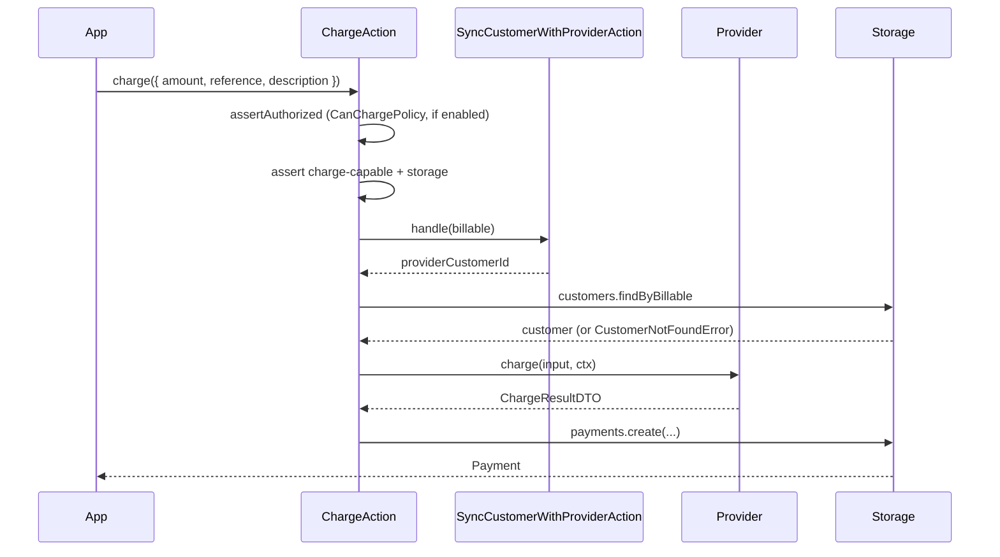
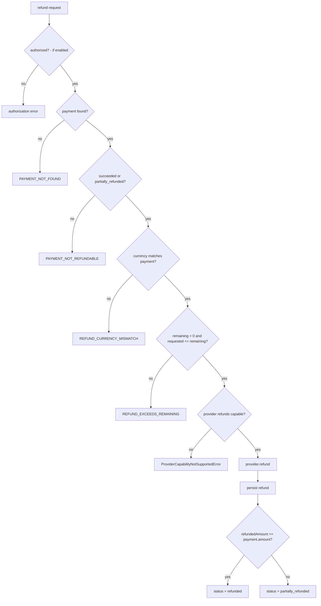

# Charges and Refunds

A **charge** is a one-off payment against a customer; a **refund** returns money against a recorded
payment, partially or in full. Both persist locally and track the payment's lifecycle through the
payment state machine.

## One-off charge

`payable.customer(billable).charge(request)` runs `ChargeAction`. The request is a `ChargeRequest`:

```ts
export interface ChargeRequest {
  amount: Money;
  reference?: string;
  description?: string;
}
```

`amount` is a `Money` value object in minor units (see [06-value-objects.md](../domain/06-value-objects.md)).

```ts
import { Money } from '@akira-io/payable';

const payment = await payable.customer(billable).charge({
  amount: Money.of(9900, 'USD'),
  reference: 'inv_1',
  description: 'one-time',
});
```

`ChargeAction.handle`:

0. Calls `assertAuthorized` with `CanChargePolicy`, gated when `deps.authorizationEnabled` is true (a
   no-op otherwise), using the optional `authorization` on the request.
1. Requires the provider to be **charge capable** (`isChargeCapable`, i.e. it implements `charge`);
   otherwise throws `ProviderCapabilityNotSupportedError`.
2. Requires a storage driver (`PAYMENT_STORAGE_REQUIRED`).
3. Syncs the customer to the provider and loads the local customer row; throws `CustomerNotFoundError`
   if missing.
4. Builds a deterministic key with `IdempotencyKey.forCharge` keyed by provider, billable,
   `reference`, amount, and currency - for example `charge:stripe:User:1:inv_1:9900:USD`.
5. Calls `provider.charge({ providerCustomerId, amount, reference, description }, ctx)`.
6. Persists a `payments` row with `status`, `currency`, `amount`, `refundedAmount: 0`, and the
   `reference`/`description`.

Output: the persisted `Payment` entity.



The provider returns a `ChargeResultDTO`: `{ providerPaymentId, status, amount }`.

## Refund

`payable.refund(request, tenantId?)` runs `RefundPaymentAction`. The optional second argument
`tenantId?: string | null` scopes the lookup when tenancy is in play. The request is `RefundRequest`:

```ts
export interface RefundRequest {
  paymentId: string;
  amount?: Money;
  reason?: string;
  reference?: string;
  authorization?: AuthorizationContext;
}
```

`paymentId` is the **local** payment id. Omit `amount` for a full refund; pass a `Money` for a partial
refund. `reference` feeds the refund idempotency key via `IdempotencyKey.forRefund`. `authorization`
carries the optional `AuthorizationContext` for the refund call.

```ts
// full refund
await payable.refund({ paymentId: payment.id });

// partial refund
await payable.refund({ paymentId: payment.id, amount: Money.of(4000, 'USD') });
```

`RefundPaymentAction.handle`:

0. Calls `assertAuthorized` with `CanRefundPaymentPolicy`, gated when `deps.authorizationEnabled` is
   true (a no-op otherwise), using the request's optional `authorization`.
1. Requires a storage driver (`PAYMENT_STORAGE_REQUIRED`).
2. Loads the payment by id; throws `PayableError` (`PAYMENT_NOT_FOUND`) if it is missing or has no
   `providerPaymentId`.
3. Requires the payment to be `succeeded` or `partially_refunded`; otherwise throws `PayableError`
   (`PAYMENT_NOT_REFUNDABLE`).
4. Rejects a currency mismatch: if the requested `amount` currency differs from the payment currency,
   throws `PayableError` (`REFUND_CURRENCY_MISMATCH`).
5. Guards against over-refund: `remaining = payment.amount - payment.refundedAmount` and
   `requested = input.amount?.amount() ?? remaining`. If `remaining <= 0` or `requested > remaining`,
   throws `PayableError` (`REFUND_EXCEEDS_REMAINING`) with context `{ paymentId, requested, remaining }`.
6. Asserts the provider's `refunds` capability via `assertProviderCapability`.
7. Builds a deterministic key with `IdempotencyKey.forRefund` keyed by provider, provider payment id,
   amount (defaulting to the full payment amount), and currency.
8. Reserves capacity: in a transaction it creates a **pending** `refunds` row up-front and applies the
   projected `refundedAmount`/`status` to the payment, holding the balance before the provider call.
9. Calls `provider.refund({ providerPaymentId, amount, reason }, ctx)`. On a provider failure (or a
   post-call currency mismatch) `releaseReservation` reverts the payment balance and flips the pending
   refund row to `failed`.
10. Recomputes `refundedAmount = payment.refundedAmount + dto.amount`. Using `PaymentStateMachine`, it
    transitions the payment to **refunded** when `refundedAmount >= payment.amount`, otherwise to
    **partially refunded**; then updates the payment's `refundedAmount` and `status`. A settlement-time
    re-check re-validates the remaining balance to guard against races before the row is written.

Output: the persisted `Refund` entity.

### Partial vs full refund

Refunds accumulate. Charging 9900 then refunding 4000 leaves the payment `partially_refunded` with
`refundedAmount` = 4000; a further refund of 5900 makes the status `refunded` with `refundedAmount`
= 9900. The full/partial decision is purely `refundedAmount` vs `payment.amount` - there is no separate
"full refund" flag.



## Policies

`CanChargePolicy`, `CanRefundPaymentPolicy`, `CanCreateCheckoutPolicy`, and
`CanCreateSubscriptionPolicy` all authorize against an `AuthorizationContext`: authorization succeeds
only when `allowed === true` and `actorId` is a non-empty string.

These policies are now **enforced** at the front of their respective paths via `assertAuthorized`,
gated by `deps.authorizationEnabled`: `ChargeAction` asserts `CanChargePolicy` (step 0) and
`RefundPaymentAction` asserts `CanRefundPaymentPolicy` (step 0), each before any storage or provider
work. When authorization is disabled the assertion is a no-op, so integrators that do not opt in see
no behavior change. Callers pass the `AuthorizationContext` through the request's `authorization`
field.

## Edge cases

- **No storage driver.** Charge and refund both throw `PAYMENT_STORAGE_REQUIRED`.
- **Provider not charge capable.** `ChargeAction` throws `ProviderCapabilityNotSupportedError`.
- **Provider lacks `refunds` capability.** `RefundPaymentAction` throws via `assertProviderCapability`.
- **Unknown payment id / no provider payment id.** `PAYMENT_NOT_FOUND`.
- **Refund currency differs from payment.** `REFUND_CURRENCY_MISMATCH`.
- **Payment not in a refundable state.** A payment that is not `succeeded` or `partially_refunded`
  throws `PAYMENT_NOT_REFUNDABLE`.
- **Refund exceeding the remaining balance.** Blocked by a dedicated guard before the provider call:
  with `remaining = payment.amount - payment.refundedAmount` and
  `requested = input.amount?.amount() ?? remaining`, the action throws `REFUND_EXCEEDS_REMAINING`
  (context `{ paymentId, requested, remaining }`) when `remaining <= 0` or `requested > remaining`. A
  settlement-time re-check re-validates the remaining balance to guard against concurrent refunds.

---

[Previous: Subscriptions](10-subscriptions.md) · [Index](../00-index.md) · [Next: Invoices and Portal](12-invoices-portal.md)
