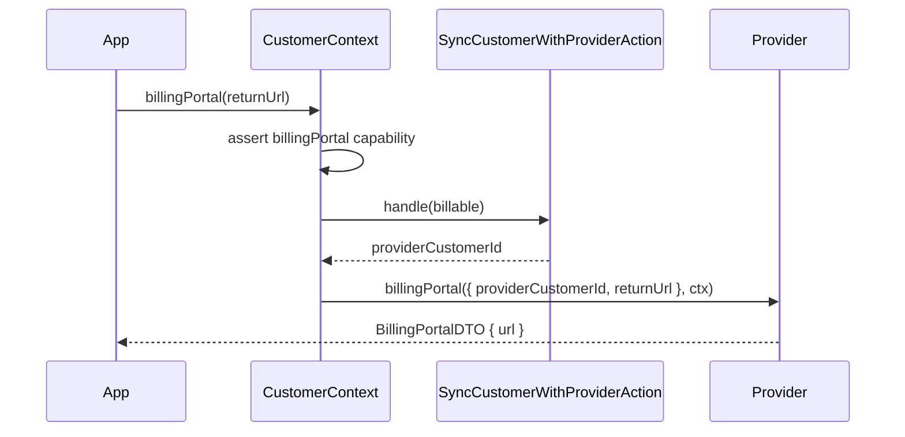

# Invoices and Billing Portal

This page covers reading a customer's invoices, downloading an invoice PDF, and opening the
provider-hosted billing portal. All three depend on optional provider capabilities and degrade or
fail explicitly when the provider does not support them.

## Listing invoices

`ListInvoicesAction` returns the customer's invoices from the provider.

```ts
const invoices = await new ListInvoicesAction(deps).handle(billable, 50);
```

`handle(billable, limit?)`:

1. Validates `limit`: when supplied it must be a positive integer, otherwise throws `PayableError`
   (`INVOICE_LIMIT_INVALID`). This runs before the capability check.
2. Requires the provider to be **invoice capable** (`isInvoiceCapable`, i.e. it implements both
   `listInvoices` and `downloadInvoicePdf`); otherwise throws `ProviderCapabilityNotSupportedError`
   (reported as the `invoicePdf` capability).
3. If there is no storage driver, returns `[]`.
4. Loads the local customer row; if it is missing or has no `providerCustomerId`, returns `[]`.
5. Calls `provider.listInvoices({ providerCustomerId, limit })`.

Output: `InvoiceDTO[]`:

```ts
export interface InvoiceDTO {
  providerInvoiceId: string;
  status: InvoiceStatus;
  total: Money;
  hostedInvoiceUrl: string | null;
  invoicePdf: string | null;
}
```

`total` is a `Money` value object; `hostedInvoiceUrl` and `invoicePdf` are provider-hosted links when
available.

## Downloading an invoice PDF

`DownloadInvoicePdfAction` fetches the raw PDF bytes for one invoice.

```ts
const pdf = await new DownloadInvoicePdfAction(deps).handle('in_1', billable);
// pdf.filename -> 'in_1.pdf', pdf.content -> Uint8Array
```

`handle(providerInvoiceId, billable?)`:

1. Requires the provider to be invoice capable; otherwise throws `ProviderCapabilityNotSupportedError`
   (reported as `invoicePdf`).
2. Requires a storage driver; otherwise throws `PayableError` (`INVOICE_STORAGE_REQUIRED`).
3. Loads the invoice by provider id (`storage.invoices.findByProviderId`). It then requires the caller
   to own the invoice via `belongsToBillable`: when the invoice is missing, when `billable` is omitted,
   or when the supplied `billable` does not own it, throws `PayableError` (`INVOICE_NOT_FOUND`).
4. Calls `provider.downloadInvoicePdf(providerInvoiceId)`.

Output: `InvoicePdfDTO`:

```ts
export interface InvoicePdfDTO {
  filename: string;
  content: Uint8Array;
}
```

**Ownership check.** `billable` is effectively **required**. When provided, the action resolves the
caller's local customer (`storage.customers.findByBillable`) and confirms it owns the invoice
(`customer.id === invoice.customerId`) before returning the bytes - a mismatch is reported as
`INVOICE_NOT_FOUND`. When `billable` is omitted, `belongsToBillable` returns `false`, so the action
**always** throws `INVOICE_NOT_FOUND`; there is no trust-the-caller path that returns bytes.

> Note: the omitted-`billable` path currently throws rather than returning bytes; this is under review
> as a possible regression of the trust-caller path.

## Billing portal

`payable.customer(billable).billingPortal(returnUrl)` returns a provider-hosted portal URL where the
customer can manage payment methods, invoices, and subscriptions.

```ts
const { url } = await payable
  .customer(billable)
  .billingPortal('https://app.test/account');

return redirect(url);
```

`billingPortal(returnUrl)`:

1. Asserts the provider's `billingPortal` capability via `assertProviderCapability`.
2. Syncs the customer to the provider (`SyncCustomerWithProviderAction`) to obtain the
   `providerCustomerId`.
3. Builds an idempotency key `portal:${providerName}:${billableType}:${billableId}`.
4. Calls `provider.billingPortal({ providerCustomerId, returnUrl }, ctx)`.

Output: `BillingPortalDTO`:

```ts
export interface BillingPortalDTO {
  url: string;
}
```



## Provider dependency and capabilities

These features ride on optional provider methods declared as capability interfaces on the
`PaymentProvider` contract:

- **Invoices.** `InvoiceCapable` (`listInvoices`, `downloadInvoicePdf`). Detected with
  `isInvoiceCapable`. The capability surfaced in errors is `invoicePdf`.
- **Billing portal.** `billingPortal` is a required method on the `PaymentProvider` contract, but its
  availability is gated by the `billingPortal` capability flag, asserted before use.

The `ProviderCapabilities` flags (`checkout`, `subscriptions`, `trials`, `refunds`, `coupons`,
`billingPortal`, `meteredBilling`, `invoicePdf`) let the application probe support before calling -
see [17-providers.md](../integrations/17-providers.md).

## Inputs and outputs

| Operation | Input | Output |
| --- | --- | --- |
| List invoices | `Billable`, optional `limit` | `InvoiceDTO[]` |
| Download PDF | `providerInvoiceId`, optional `billable` | `InvoicePdfDTO` (`{ filename, content }`) |
| Billing portal | `returnUrl` | `BillingPortalDTO` (`{ url }`) |

## Edge cases

- **Provider lacks invoice capability.** Both invoice actions throw
  `ProviderCapabilityNotSupportedError` (`invoicePdf`).
- **Provider lacks the billing-portal capability.** `billingPortal()` throws via
  `assertProviderCapability` before any sync or provider call.
- **No storage driver (invoices).** `ListInvoicesAction` returns `[]` instead of throwing.
- **No local customer / unmapped customer (invoices).** Returns `[]`.
- **Billing portal without storage.** The portal still syncs the customer via the provider, which
  requires no storage to obtain a `providerCustomerId`, but nothing is persisted - see
  [08-customers-billable.md](08-customers-billable.md).
- **PDF ownership.** Pass `billable` to `DownloadInvoicePdfAction.handle` to verify the invoice belongs
  to that caller (mismatch -> `INVOICE_NOT_FOUND`). Omitting it is not a trust-the-caller path: with no
  `billable`, ownership cannot be confirmed and the action always throws `INVOICE_NOT_FOUND`.
- **Invalid list limit.** `ListInvoicesAction` throws `INVOICE_LIMIT_INVALID` for a non-positive-integer
  `limit`, before the capability check.
- **PDF without storage.** `DownloadInvoicePdfAction` throws `INVOICE_STORAGE_REQUIRED` when no storage
  driver is configured.

---

[Previous: Charges and Refunds](11-charges-refunds.md) · [Index](../00-index.md) · [Next: Webhooks](13-webhooks.md)
