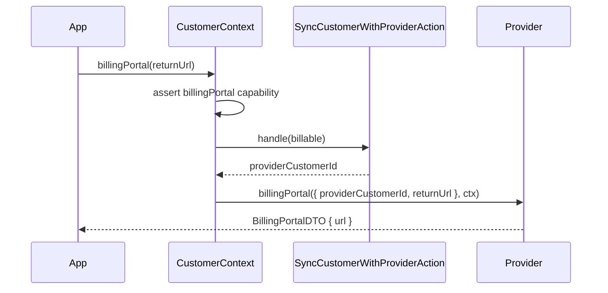

# Invoices and Billing Portal

This page covers reading a customer's invoices, downloading an invoice PDF, and opening the
provider-hosted billing portal. All three depend on optional provider capabilities and degrade or
fail explicitly when the provider does not support them.

## Canonical local invoices

`payable.canonicalInvoices(tenantId)` manages Payable-owned invoice records without resolving or
calling a provider. A canonical invoice has a stable local ID, canonical customer and optional
subscription relationships, amounts in minor units, lifecycle status, and optional document
metadata. Provider identifiers are stored in separate bindings and never replace the local ID.

```ts
const invoices = payable.canonicalInvoices('tenant-1');
const invoice = await invoices.create({
  customerId: customer.id,
  subscriptionId: subscription.id,
  status: 'open',
  currency: 'EUR',
  total: 4900,
  amountPaid: 0,
  amountDue: 4900,
  number: 'INV-100',
});

await invoices.attachPayment(invoice.id, payment.id);
await invoices.attachProvider(invoice.id, {
  provider: 'stripe-primary',
  providerResourceType: 'invoice',
  providerResourceId: 'in_100',
});
```

`list()` returns the standard bounded canonical page with an opaque cursor. `retrieve()` and page
items expose stable `bindings` and `paymentIds` arrays, including empty arrays for invoices without
relationships. Attach operations validate the same tenant and never infer relationships from
provider IDs, invoice numbers, email addresses, labels, currency, or amount matching.

Canonical reads are available at `/canonical/invoices` and `/canonical/invoices/:id` in Express,
Fastify, and Nest, and through `canonical_invoices_list` and `canonical_invoice_get` in MCP.

The existing `payable.invoices(providerName, tenantId)` API remains the provider-native
compatibility path for provider listing and PDF download. PDF retrieval continues to use the
provider invoice ID and its existing ownership and capability checks. Stripe invoice IDs and Paddle
transaction IDs are binding metadata, not canonical route identities.

The forward migration copies legacy invoice rows without changing their local IDs or values and
creates a provider binding only when both provider and provider invoice ID are present. Incomplete
provider identities remain as canonical invoices and are reported as unresolved. A customer must
be proven in the same tenant before its invoice is canonicalized; an unproven optional subscription
is left unmapped. Conflicting provider resources are reported and skipped instead of aborting the
migration. Stripe resources retain the `invoice` type while Paddle transaction IDs use
`transaction`. Payment relationships are never guessed during backfill.

The forward-only ledger runs invoice migration as step `020-canonical-invoices`, after local
payment evidence step `019`. It stores the structured JSON result in
`payable_migration_reports` under the step name. Operators should inspect that row after an
upgrade and resolve non-zero orphan, mismatch, conflict, unresolved, or unmapped counters before
any later schema contraction. Replaying the migration is additive and cannot restore a dropped
legacy field, so database snapshots remain the rollback boundary.

## Listing invoices

`ListInvoicesAction` returns the customer's invoices from the provider.

```ts
const invoices = await new ListInvoicesAction(deps).handle(billable, 50);
```

`handle(billable, limit?)`:

1. Validates `limit`: when supplied it must be a positive integer, otherwise throws `PayableError`
   (`INVOICE_LIMIT_INVALID`). This runs before the capability check.
2. Requires the provider to be **invoice capable** (`isInvoiceCapable`, i.e. it implements both
   `listInvoices` and `downloadInvoicePdf`); otherwise throws `ProviderCapabilityNotSupportedError`
   (reported as the `invoicePdf` capability).
3. If there is no storage driver, returns `[]`.
4. Loads the logical customer and its binding for the selected registered provider; if either is
   missing, returns `[]`.
5. Calls `provider.listInvoices({ providerCustomerId: binding.providerCustomerId, limit })`.

Output: `InvoiceDTO[]`:

```ts
export interface InvoiceDTO {
  providerInvoiceId: string;
  status: InvoiceStatus;
  total: Money;
  hostedInvoiceUrl: string | null;
  invoicePdf: string | null;
}
```

`total` is a `Money` value object; `hostedInvoiceUrl` and `invoicePdf` are provider-hosted links when
available.

## Downloading an invoice PDF

`DownloadInvoicePdfAction` fetches the raw PDF bytes for one invoice.

```ts
const pdf = await new DownloadInvoicePdfAction(deps).handle('in_1', billable);
// pdf.filename -> 'in_1.pdf', pdf.content -> Uint8Array
```

`handle(providerInvoiceId, billable?)`:

1. Requires the provider to be invoice capable; otherwise throws `ProviderCapabilityNotSupportedError`
   (reported as `invoicePdf`).
2. Requires a storage driver; otherwise throws `PayableError` (`INVOICE_STORAGE_REQUIRED`).
3. Loads the invoice by provider id (`storage.invoices.findByProviderId`). It then requires the caller
   to own the invoice via `belongsToBillable`: when the invoice is missing, when `billable` is omitted,
   or when the supplied `billable` does not own it, throws `PayableError` (`INVOICE_NOT_FOUND`).
4. Calls `provider.downloadInvoicePdf(providerInvoiceId)`.

Output: `InvoicePdfDTO`:

```ts
export interface InvoicePdfDTO {
  filename: string;
  content: Uint8Array;
}
```

**Ownership check.** `billable` is effectively **required**. When provided, the action resolves the
caller's local customer (`storage.customers.findByBillable`) and confirms it owns the invoice
(`customer.id === invoice.customerId`) before returning the bytes - a mismatch is reported as
`INVOICE_NOT_FOUND`. When `billable` is omitted, `belongsToBillable` returns `false`, so the action
**always** throws `INVOICE_NOT_FOUND`; there is no trust-the-caller path that returns bytes.

> Note: the omitted-`billable` path currently throws rather than returning bytes; this is under review
> as a possible regression of the trust-caller path.

## Billing portal

`payable.customer(billable).billingPortal(returnUrl)` returns a provider-hosted portal URL where the
customer can manage payment methods, invoices, and subscriptions.

```ts
const { url } = await payable
  .customer(billable)
  .billingPortal('https://app.test/account');

return redirect(url);
```

`billingPortal(returnUrl)`:

1. Asserts the provider's `billingPortal` capability via `assertProviderCapability`.
2. Syncs the customer to the provider (`SyncCustomerWithProviderAction`) to obtain the
   `providerCustomerId`.
3. Builds an idempotency key `portal:${providerName}:${billableType}:${billableId}`.
4. Calls `provider.billingPortal({ providerCustomerId, returnUrl }, ctx)`.

Output: `BillingPortalDTO`:

```ts
export interface BillingPortalDTO {
  url: string;
}
```


```mermaid
sequenceDiagram
    participant App
    participant Ctx as CustomerContext
    participant Sync as SyncCustomerWithProviderAction
    participant Provider
    App->>Ctx: billingPortal(returnUrl)
    Ctx->>Ctx: assert billingPortal capability
    Ctx->>Sync: handle(billable)
    Sync-->>Ctx: providerCustomerId
    Ctx->>Provider: billingPortal({ providerCustomerId, returnUrl }, ctx)
    Provider-->>App: BillingPortalDTO { url }
```

## Provider dependency and capabilities

These features ride on optional provider methods declared as capability interfaces on the
`PaymentProvider` contract:

- **Invoices.** `InvoiceCapable` (`listInvoices`, `downloadInvoicePdf`). Detected with
  `isInvoiceCapable`. The capability surfaced in errors is `invoicePdf`.
- **Billing portal.** `billingPortal` is a required method on the `PaymentProvider` contract, but its
  availability is gated by the `billingPortal` capability flag, asserted before use.

The `ProviderCapabilities` flags (`checkout`, `subscriptions`, `trials`, `refunds`, `coupons`,
`billingPortal`, `meteredBilling`, `invoicePdf`) let the application probe support before calling -
see [17-providers.md](../integrations/17-providers.md).

## Inputs and outputs

| Operation | Input | Output |
| --- | --- | --- |
| List invoices | `Billable`, optional `limit` | `InvoiceDTO[]` |
| Download PDF | `providerInvoiceId`, optional `billable` | `InvoicePdfDTO` (`{ filename, content }`) |
| Billing portal | `returnUrl` | `BillingPortalDTO` (`{ url }`) |

## Edge cases

- **Provider lacks invoice capability.** Both invoice actions throw
  `ProviderCapabilityNotSupportedError` (`invoicePdf`).
- **Provider lacks the billing-portal capability.** `billingPortal()` throws via
  `assertProviderCapability` before any sync or provider call.
- **No storage driver (invoices).** `ListInvoicesAction` returns `[]` instead of throwing.
- **No logical customer / no binding for the selected provider (invoices).** Returns `[]`.
- **Billing portal without storage.** The portal still syncs the customer via the provider, which
  requires no storage to obtain a `providerCustomerId`, but nothing is persisted - see
  [08-customers-billable.md](08-customers-billable.md).
- **PDF ownership.** Pass `billable` to `DownloadInvoicePdfAction.handle` to verify the invoice belongs
  to that caller (mismatch -> `INVOICE_NOT_FOUND`). Omitting it is not a trust-the-caller path: with no
  `billable`, ownership cannot be confirmed and the action always throws `INVOICE_NOT_FOUND`.
- **Invalid list limit.** `ListInvoicesAction` throws `INVOICE_LIMIT_INVALID` for a non-positive-integer
  `limit`, before the capability check.
- **PDF without storage.** `DownloadInvoicePdfAction` throws `INVOICE_STORAGE_REQUIRED` when no storage
  driver is configured.

---

[Previous: Charges and Refunds](11-charges-refunds.md) · [Index](../00-index.md) · [Next: Webhooks](13-webhooks.md)
