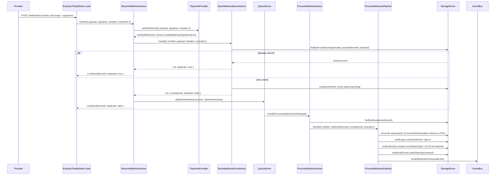

# Webhooks

Webhooks are how a payment provider tells Payable that something happened out of band - a checkout
completed, a subscription renewed, a payment failed. Payable receives the raw HTTP request, verifies
the provider signature, normalizes the event, deduplicates it, persists it, and only then processes
it asynchronously. Processing reconciles local state, writes an audit log, stages an outbox event,
and emits a domain event. Every step is idempotent so the same provider event can arrive twice
without double-applying.

## Pipeline overview



## HTTP entry point

Two routes are registered. Express is shown below; Fastify and Nest mirror it
(`src/presentation/express/routes/webhooks.routes.ts`).

```ts
router.post('/webhooks', raw({ type: '*/*', limit: WEBHOOK_BODY_LIMIT }), handler);
router.post('/webhooks/:provider', raw({ type: '*/*', limit: WEBHOOK_BODY_LIMIT }), handler);
```

- `POST /webhooks` - no provider in the path. The provider is inferred (see provider resolution
  below). Only safe when exactly one provider is registered.
- `POST /webhooks/:provider` - the provider is taken from the path parameter. Required when more
  than one provider is registered.

### Raw body is mandatory

Signature verification runs against the exact bytes the provider signed. The route mounts
`express.raw({ type: '*/*' })` so `req.body` is a `Buffer`, and the handler rejects anything else:

```ts
if (!Buffer.isBuffer(req.body)) {
  throw new PayableError(
    'Webhook body must be the raw request buffer; mount the webhook router before any JSON body parser',
    { code: 'INVALID_WEBHOOK_PAYLOAD' },
  );
}
```

The webhook router must be mounted **before** any JSON body parser, otherwise the body is already
parsed and verification fails. The signature is read from a configurable header (default
`stripe-signature`) via `options.webhookSignatureHeader`. Body size is capped at `1mb`.

## Provider resolution and ambiguity

`Payable.receiveWebhook` resolves the provider name before building dependencies
(`src/payable.ts`):

```ts
private defaultWebhookProvider(): string {
  const names = this.registry.names();
  if (names.length > 1) {
    throw new PayableError(
      'Multiple providers are registered; route the webhook to /webhooks/:provider',
      { code: 'WEBHOOK_PROVIDER_AMBIGUOUS' },
    );
  }
  ...
}
```

- An explicit provider (from `/webhooks/:provider`) is always used.
- Without one, the single registered provider is used.
- With multiple providers registered and no explicit provider, Payable **rejects** the request with
  `WEBHOOK_PROVIDER_AMBIGUOUS` (HTTP 400) rather than silently defaulting to the first provider. This
  prevents misrouting a Paddle event to the Stripe verifier.

Webhook processing also requires a storage driver; without one Payable throws
`WEBHOOK_STORAGE_REQUIRED` (HTTP 500).

## Step 1 - Receive and verify

`ReceiveWebhookAction` (`src/application/actions/webhooks/receive-webhook.action.ts`) drives the
synchronous portion:

```ts
const verified = await this.deps.provider.verifyWebhook({
  payload: input.payload,
  signature: input.signature,
  headers: input.headers,
});
const tenantId = await this.resolveTenant(input);
const stored = await new StoreWebhookEventAction(this.deps).handle({ ... });
if (stored.duplicate) {
  return { webhookEventId: stored.id, duplicate: true };
}
await new DispatchWebhookJobAction(this.deps.queue).handle({ ... });
return { webhookEventId: stored.id, duplicate: false };
```

`verifyWebhook` is provider-specific. For Stripe
(`src/infrastructure/providers/stripe/stripe-webhook-verifier.ts`) it delegates to
`stripe.webhooks.constructEventAsync`; any failure becomes an `InvalidWebhookSignatureError`:

```ts
try {
  return await stripe.webhooks.constructEventAsync(payload, signature, this.secret);
} catch (error) {
  throw new InvalidWebhookSignatureError('stripe', { cause: error });
}
```

The verifier returns a `VerifiedWebhook` (`src/domain/dtos/webhook.dto.ts`):

```ts
export interface VerifiedWebhook {
  providerEventId: string;
  type: string;                          // raw provider type, e.g. "checkout.session.completed"
  normalizedType: NormalizedEventName | null;  // e.g. "checkout.completed", null if unmapped
  data: Record<string, unknown>;
}
```

Tenant resolution runs after verification: an explicit `tenantId` on the input wins; otherwise the
configured `TenantResolver` is consulted; otherwise the tenant is `null`. See
[Multi-Tenancy](16-multi-tenancy.md).

## Step 2 - Deduplicate and store

`StoreWebhookEventAction` (`src/application/actions/webhooks/store-webhook-event.action.ts`)
deduplicates on `(provider, providerEventId, tenantId)`:

```ts
const existing = await storage.webhookEvents.findByProviderEvent(
  providerName, input.verified.providerEventId, tenantId,
);
if (existing) {
  return { id: existing.id, correlationId: existing.correlationId, duplicate: true };
}
```

If no row exists it inserts a `WebhookEvent` with `status: 'pending'` and a freshly generated
`correlationId`. Two safeguards make this race-safe:

1. The pre-check above catches the common duplicate path.
2. If the insert throws (unique constraint hit by a concurrent receive), it re-queries
   `findByProviderEvent`; if a row now exists it is treated as a duplicate, otherwise the original
   error is rethrown.

Stored fields (`src/domain/entities/webhook-event.entity.ts`): `provider`, `providerEventId`,
`type`, `normalizedType`, the raw `payload` string, parsed `data`, `headers`, `status`,
`correlationId`, `receivedAt`. Headers are passed through `redactHeaders`
(`src/support/redact-headers.ts`) which drops `authorization`, `cookie`, `stripe-signature`,
`paddle-signature`, and similar before persistence. When an encryption driver is configured, the
`payload`, `data`, and `headers` columns are sealed as ciphertext at rest (see
[Reliability](15-reliability.md)).

A duplicate short-circuits the pipeline: it is **not** re-dispatched to the queue and returns
`duplicate: true`.

## Step 3 - Dispatch to the queue

For a new event, `DispatchWebhookJobAction`
(`src/application/actions/webhooks/dispatch-webhook-job.action.ts`) enqueues a `webhook.process`
job:

```ts
await this.queue.dispatch({
  name: PROCESS_WEBHOOK_JOB,
  payload,
  correlationId: payload.correlationId,
  idempotencyKey: IdempotencyKey.forWebhook({
    provider: payload.providerName,
    providerEventId: payload.providerEventId,
  }).toString(),
});
```

The job carries an idempotency key of the form `webhook:<provider>:<providerEventId>`, so a queue
driver that honors idempotency keys will not run the same event twice. With the default
`SyncQueueDriver` the job runs inline during the request.

## Step 4 - Process

`ProcessWebhookAction` (`src/application/actions/webhooks/process-webhook.action.ts`) reloads the
event by id (throwing `WEBHOOK_EVENT_NOT_FOUND` if missing), reconstructs the `VerifiedWebhook` from
the stored row, and hands off to `ProcessWebhookPipeline`. Re-reading from storage means processing
operates on the persisted, deduplicated record rather than trusting the dispatched payload.

## Step 5 - The processing pipeline

`ProcessWebhookPipeline` (`src/application/pipelines/webhooks/process-webhook.pipeline.ts`) runs the
side effects in order:

1. **Reconcile local state.** `provider.reconcileSubscription(verified)` returns a subscription DTO
   or `null`. If a DTO is returned and a local subscription exists for that provider id, the local
   row is patched with `status`, `currentPeriodEnd`, `trialEndsAt`, and - when the status is
   `canceled` - `endsAt`. If the provider returns `null` or there is no matching local
   subscription, reconciliation is a no-op.
2. **Audit log.** Writes an immutable entry with `action: webhook.<type>`, `actorType: 'provider'`,
   `actorId: <providerName>`, `resourceType: 'webhook_event'`, `before: null`, `after: data`, and
   the correlation id.
3. **Outbox.** If `normalizedType` is set, stages an outbox event of type `<normalizedType>.v1`
   carrying `{ providerEventId, data }`. Unmapped events (normalizedType `null`) are stored and
   processed but produce no outbox event.
4. **Mark processed.** `webhookEvents.markStatus(id, 'processed', occurredAt)`.
5. **Emit.** Emits `WebhookProcessedEvent` on the event bus with the correlation id.

## Replay

A previously stored webhook event can be reprocessed through the same pipeline.
`Payable.replayWebhook(webhookEventId, context?, provider?)` calls `ReplayWebhookAction`
(`src/application/actions/webhooks/replay-webhook.action.ts`):

```ts
if (!this.policy.authorize(context)) {
  throw new PayableError('Webhook replay not permitted', { code: 'WEBHOOK_REPLAY_DENIED' });
}
const event = await this.deps.storage.webhookEvents.findById(webhookEventId);
if (!event) { throw new PayableError(..., { code: 'WEBHOOK_EVENT_NOT_FOUND' }); }
if (context.tenantId !== undefined && (event.tenantId ?? null) !== (context.tenantId ?? null)) {
  throw new PayableError('Webhook replay not permitted', { code: 'WEBHOOK_REPLAY_DENIED' });
}
```

Replay runs `ProcessWebhookPipeline` directly (it does not re-verify a signature or re-store the
event) with a **new** correlation id, so the replay is traceable as a distinct run. It does not
re-dispatch to the queue.

### Replay authorization

`CanReplayWebhookPolicy` (`src/application/policies/can-replay-webhook.policy.ts`) requires both an
explicit allow flag and a non-empty actor:

```ts
authorize(context: ReplayWebhookContext = {}): boolean {
  return context.allowed === true && this.hasActor(context);
}
private hasActor(context: ReplayWebhookContext): boolean {
  return typeof context.actorId === 'string' && context.actorId.length > 0;
}
```

So `replayWebhook` only proceeds when `context.allowed === true` and `context.actorId` is set. In
addition, when `context.tenantId` is provided it must match the stored event's tenant; a mismatch is
denied with `WEBHOOK_REPLAY_DENIED`.

## Inputs and outputs

`receiveWebhook` input (`ReceiveWebhookInput & { provider?: string }`):

| Field       | Type                          | Notes                                          |
| ----------- | ----------------------------- | ---------------------------------------------- |
| `payload`   | `string`                      | Raw request body, exactly as signed            |
| `signature` | `string`                      | Provider signature header value                |
| `headers`   | `Record<string, string>`      | Optional; redacted before storage              |
| `tenantId`  | `string \| null`              | Optional; overrides the resolver               |
| `provider`  | `string`                      | Optional; from `/webhooks/:provider`           |

Result:

```ts
export interface ReceiveWebhookResult {
  webhookEventId: string;
  duplicate: boolean;
}
```

## Failure scenarios and edge cases

| Scenario                                   | Outcome                                                        |
| ------------------------------------------ | ------------------------------------------------------------- |
| Bad / missing signature                    | `InvalidWebhookSignatureError` → HTTP 400 `INVALID_WEBHOOK_SIGNATURE` |
| Body is not a raw buffer                   | `INVALID_WEBHOOK_PAYLOAD` → HTTP 400                           |
| Multiple providers, no `:provider`         | `WEBHOOK_PROVIDER_AMBIGUOUS` → HTTP 400                        |
| No storage driver configured               | `WEBHOOK_STORAGE_REQUIRED` → HTTP 500                          |
| Duplicate event (same provider event id)   | Returns `duplicate: true`, no requeue, no reprocess           |
| Concurrent receive of the same event       | Insert race re-queried; second caller gets `duplicate: true`  |
| Unknown / unmapped event type              | Stored and processed; `normalizedType` is `null`; no outbox event |
| `reconcileSubscription` returns `null`     | No local state change; audit + outbox + processed still run   |
| Local subscription not found               | Reconciliation skipped; rest of the pipeline runs             |
| Event id not found during process/replay   | `WEBHOOK_EVENT_NOT_FOUND` → HTTP 404                           |
| Replay without `allowed`/`actorId`         | `WEBHOOK_REPLAY_DENIED` → HTTP 403                             |
| Replay with mismatched tenant              | `WEBHOOK_REPLAY_DENIED` → HTTP 403                             |

> `WebhookDeliveryService` (`src/application/services/webhook-delivery/webhook-delivery-service.ts`)
> is a placeholder for outbound webhook delivery and currently throws `NOT_IMPLEMENTED` (Phase 11).
> The pipeline above covers **inbound** provider webhooks only.

---

[Previous: Invoices Portal](12-invoices-portal.md) · [Index](../00-index.md) · [Next: Idempotency](14-idempotency.md)
