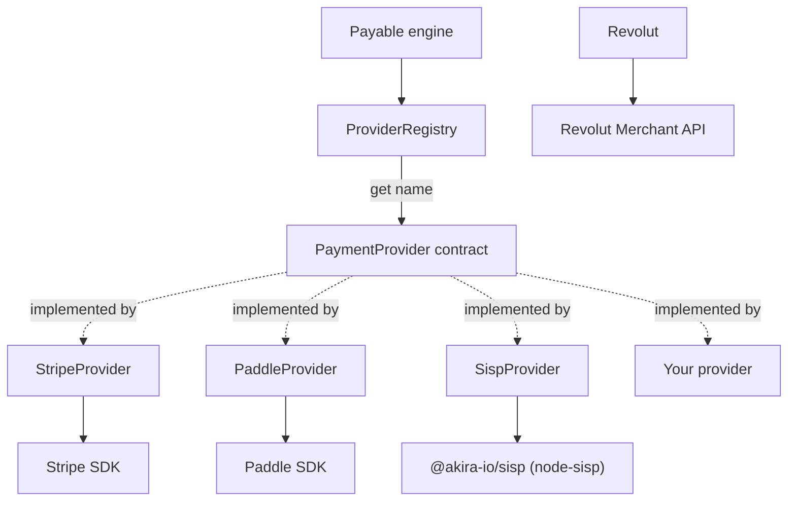

# Payment Providers

Every payment integration in `@akira-io/payable` is reduced to a single interface: `PaymentProvider`.
The engine never talks to Stripe or Paddle directly. It talks to the contract, and concrete adapters
translate domain DTOs into provider SDK or API calls and provider webhooks back into domain events. This keeps
the application and domain layers provider-agnostic and makes a new integration a matter of implementing
one interface.

The contract lives in `src/domain/contracts/payment-provider.contract.ts`.

## The `PaymentProvider` contract

`PaymentProvider` is deliberately small. It declares only the surface that **every** provider can
honour, regardless of its business model. A subscription/SaaS gateway (Stripe, Paddle) and a one-time
hosted-redirect gateway (SISP) both satisfy it. All methods that reach a provider API are asynchronous
and receive an `OperationContext` (`ctx`) carrying the idempotency key.

| Member | Input | Output |
| --- | --- | --- |
| `name` (readonly property) | - | `string` - the registry key, e.g. `'stripe'` |
| `capabilities()` | - | `ProviderCapabilities` |
| `createCheckoutSession(input, ctx)` | `CreateCheckoutSessionInput` | `Promise<CheckoutSessionDTO>` |
| `refund(input, ctx)` | `RefundInput` | `Promise<RefundResultDTO>` |

Everything else - customers, catalog, subscription management, webhooks, the billing portal - is an
**optional capability interface**. A provider implements only the ones it genuinely supports, and the
engine narrows to them at runtime with a type guard before calling. This is why SISP (which has no
customers API, no catalog, no subscriptions, and no asynchronous signed webhook) can be a first-class
provider: it implements the slim core plus the one optional interface that fits its redirect flow.

### Optional capability interfaces

Each interface lives in `src/domain/contracts/payment-provider.contract.ts` and ships with a structural
`isXCapable` guard (duck-typing on method presence). Calling code narrows first, then either calls the
method or throws `ProviderCapabilityNotSupportedError`.

| Interface | Method(s) | Guard |
| --- | --- | --- |
| `CustomerCapable` | `createCustomer(input, ctx)`, `updateCustomer(input, ctx)` | `isCustomerCapable(provider)` |
| `CatalogCapable` | `createProduct`, `updateProduct`, `createPrice` | `isCatalogCapable(provider)` |
| `SubscriptionManagementCapable` | `updateSubscription`, `cancelSubscription`, `resumeSubscription` | `isSubscriptionManagementCapable(provider)` |
| `WebhookCapable` | `verifyWebhook(input)`, `reconcileSubscription(verified)` | `isWebhookCapable(provider)` |
| `PaymentWebhookCapable` | `reconcilePayment(verified)` | `isPaymentWebhookCapable(provider)` |
| `BillingPortalCapable` | `billingPortal(input, ctx)` | `isBillingPortalCapable(provider)` |
| `RedirectCallbackCapable` | `verifyCallback(payload)`, `handleRedirectCallback(payload)` | `isRedirectCallbackCapable(provider)` |
| `ChargeCapable` | `charge(input, ctx)` | `isChargeCapable(provider)` |
| `DirectSubscriptionCapable` | `createSubscription(input, ctx)` | `isDirectSubscriptionCapable(provider)` |
| `InvoiceCapable` | `listInvoices(input)`, `downloadInvoicePdf(id)` | `isInvoiceCapable(provider)` |
| `PaymentMethodCapable` | `listPaymentMethods(input)`, `deletePaymentMethod(input, ctx)` | `isPaymentMethodCapable(provider)` |
| `DisputeCapable` | `listDisputes(input)`, `retrieveDispute(id)`, `acceptDispute(id, ctx)` | `isDisputeCapable(provider)` |
| `PayoutCapable` | `listPayouts(input)`, `retrievePayout(id)` | `isPayoutCapable(provider)` |
| `ProviderWebhookEndpointManagementCapable` | provider webhook endpoint CRUD with bounded listing | `isProviderWebhookEndpointManagementCapable(provider)` |

Notes on the non-obvious members:

- `verifyWebhook` (on `WebhookCapable`) takes no `ctx`. Its input is `{ payload, signature, headers? }`
  and it returns a `VerifiedWebhook` with `providerEventId`, raw `type`, the engine's `normalizedType`,
  and the event `data`. A failed signature throws `InvalidWebhookSignatureError`.
- `reconcileSubscription` is synchronous and pure. Given an already-verified webhook it returns a
  `SubscriptionDTO` when the normalized type starts with `subscription.`, otherwise `null`.
- `PaymentWebhookCapable` is separate from `WebhookCapable`. It lets hosted-checkout providers map an
  already-verified payment webhook to `{ providerPaymentId, status }` without forcing every
  webhook-capable provider to implement payment reconciliation.
- `RedirectCallbackCapable` models a synchronous browser-POST callback (SISP), not an asynchronous
  signed webhook. `handleRedirectCallback` returns a normalized `{ providerPaymentId, status }` the
  engine uses to reconcile a local payment. See [SISP](20-sisp.md).

### Narrowing helper

For capabilities that are also declared in the `ProviderCapabilities` set and backed by optional
interfaces, the engine uses `assertCapableProvider`
(`src/application/services/provider-capabilities/assert-provider-capability.ts`), which checks the set
**and** narrows the type in one step:

```ts
assertCapableProvider(provider, 'customers', isCustomerCapable);
// provider is now PaymentProvider & CustomerCapable
```

Some provider features are represented both ways: a known capability string for honest feature
advertising and an optional interface for the callable methods. Examples include `customers`
(`CustomerCapable`), `invoicePdf` (`InvoiceCapable`), `charges` (`ChargeCapable`), and `webhooks`
(`WebhookCapable`). Redirect callbacks remain guard-only because they model a provider-specific browser
callback flow, not an asynchronous provider webhook.

### Capability matrix

| Capability | Stripe | Paddle | SISP | Revolut |
| --- | --- | --- | --- | --- |
| `checkout` | yes | yes | yes (redirect form) | yes (amount order, subscription setup order) |
| `refunds` | yes | yes | yes | yes (amount required) |
| `customers` | yes | yes | no (local-only customers) | yes |
| `catalog` | yes | yes | no | no |
| `subscriptions` | yes | yes | no | yes (limited) |
| `billingPortal` | yes | yes | no | no |
| `webhooks` (`WebhookCapable`) | yes | yes | no (uses redirect callback) | yes |
| `PaymentWebhookCapable` | yes | no | no | yes |
| `RedirectCallbackCapable` | no | no | yes | no |
| `charges` (`ChargeCapable`) | yes | no | no | no |
| `invoicePdf` (`InvoiceCapable`) | yes | no | no | no |
| `paymentMethods` (`PaymentMethodCapable`) | yes | no | no | yes |
| `disputes` (`DisputeCapable`) | yes | no | no | yes (production only) |
| `payouts` (`PayoutCapable`) | yes | no | no | yes |
| `webhookEndpointManagement` | yes | no | no | yes |

## The capabilities system

A provider declares the feature set it supports through `capabilities()`, which returns a
`ProviderCapabilities` (`src/domain/dtos/capabilities.dto.ts`):

```ts
export type ProviderCapability =
  | 'checkout'
  | 'charges'
  | 'subscriptions'
  | 'trials'
  | 'refunds'
  | 'coupons'
  | 'billingPortal'
  | 'meteredBilling'
  | 'invoicePdf'
  | 'webhooks'
  | 'customers'
  | 'paymentMethods'
  | 'disputes'
  | 'payouts'
  | 'webhookEndpointManagement'
  | 'catalog';

export type ProviderCapabilityValue = ProviderCapability | (string & {});

export type ProviderCapabilities = ReadonlySet<ProviderCapabilityValue>;
```

It is a set, not a fixed matrix. A provider lists only what it supports; an absent capability means
unsupported (opt-in by presence). `ProviderCapabilityValue` is the union of known capabilities plus an
open `string` arm, so a provider may declare custom capabilities the core does not know about (for
example `'x-acme-dunning'`) while the known names keep autocomplete. Adding a new core capability is a
new union member, not a new required field, so it does not break existing custom providers.

This is distinct from the optional interfaces above. The interfaces answer "does this method exist?";
`ProviderCapabilities` answers "does the provider claim to support this feature?". The engine guards a
declared capability with `assertProviderCapability`
(`src/application/services/provider-capabilities/assert-provider-capability.ts`):

```ts
export function assertProviderCapability(
  provider: PaymentProvider,
  capability: ProviderCapabilityValue,
): void {
  if (!provider.capabilities().has(capability)) {
    throw new ProviderCapabilityNotSupportedError(provider.name, capability);
  }
}
```

When the capability is absent from the set, it throws `ProviderCapabilityNotSupportedError`
(`src/domain/errors/provider-capability-not-supported.error.ts`) with code
`PROVIDER_CAPABILITY_NOT_SUPPORTED` and a message of the form
`Provider '<name>' does not support capability: <capability>`. The error context carries
`{ provider, capability }`.

- Purpose: fail fast and explicitly before reaching the provider API for an unsupported operation.
- Edge case: a provider may also throw `ProviderCapabilityNotSupportedError` from inside a method for a
  partial limitation. Paddle does this for partial refunds (see the Paddle integration page).

`customers` and `catalog` gate the resource managers, not all providers expose customer or catalog
write APIs:

- **`customers`** guards `payable.customers().create(...)` and `.update(...)`. A read with `.get(...)`
  comes from local storage and is not gated. Provider-backed customer sync also requires the
  `customers` capability before calling `createCustomer` or `updateCustomer`. If a stored customer has
  a provider customer id and the provider declares `customers`, update requires the full
  `CustomerCapable` interface instead of silently falling back to local-only changes.
- **`catalog`** guards `payable.products().create(...) / .update(...)` and `payable.prices().create(...)`.
- **`subscriptions`** guards subscription management. Direct subscription creation also requires this
  declared capability before storage or provider calls, but a provider may still omit
  `DirectSubscriptionCapable` and support subscription creation only through checkout.
- **`charges`** guards direct charge creation before the provider is called.
- **`invoicePdf`** guards invoice listing and PDF download before invoice provider methods are used.
- **`webhooks`** guards webhook receipt before signature verification is delegated to the provider.
  Replay and subscription reconciliation also treat providers without this declared capability as
  stored-event-only, even if a provider object happens to expose webhook-shaped methods.

A provider whose set omits a required capability rejects the corresponding operation with
`PROVIDER_CAPABILITY_NOT_SUPPORTED` (HTTP 422) before any network call.

## The provider registry

`ProviderRegistry` (`src/payable.ts`) is a thin `Map<string, PaymentProvider>` wrapper:

| Method | Behavior |
| --- | --- |
| `register(name, provider)` | Stores a provider under `name`. |
| `get(name)` | Returns the provider, or throws `ProviderNotFoundError` (`PROVIDER_NOT_FOUND`) when absent. |
| `has(name)` | `true` when a provider is registered under `name`. |
| `names()` | Registered provider names, in insertion order. |

The registry is built from the resolved config and exposed via `payable.providers()`.

### Provider selection and ambiguity

Selection rules:

- Passing a name targets it explicitly: `payable.customer(billable, 'secondary')` routes to the
  `secondary` provider.
- Omitting the name defaults to the first registered provider: `names()[0]`.
- An unknown name throws `ProviderNotFoundError`.

Webhook routing has a stricter ambiguity rule (`Payable.defaultWebhookProvider` in `src/payable.ts`):
when more than one provider is registered and the incoming webhook does not name a provider, the engine
throws `PayableError` with code `WEBHOOK_PROVIDER_AMBIGUOUS` and the message
`Multiple providers are registered; route the webhook to /webhooks/:provider`. With a single provider it
is inferred.



## Implementing a custom provider

A minimal provider implements the slim `PaymentProvider` core, declares its `name` and `capabilities()`,
and adds only the optional interfaces it genuinely supports. The `implements` list and the
`capabilities()` set must agree.

```ts
import type {
  PaymentProvider,
  CustomerCapable,
  ChargeCapable,
} from '@akira-io/payable';

export class AcmeProvider implements PaymentProvider, CustomerCapable, ChargeCapable {
  readonly name = 'acme';

  capabilities() {
    return new Set(['checkout', 'charges', 'refunds', 'customers', 'x-acme-dunning']);
  }

  async createCheckoutSession(input, ctx) { /* ...map to Acme hosted checkout... */ }
  async refund(input, ctx) { /* ...map to Acme refund... */ }

  // CustomerCapable
  async createCustomer(input, ctx) {
    const customer = await this.api.createCustomer(input.email, ctx.idempotencyKey);
    return { providerCustomerId: customer.id, email: customer.email, name: customer.name ?? null };
  }
  async updateCustomer(input, ctx) { /* ... */ }

  // ChargeCapable
  async charge(input, ctx) {
    const charge = await this.api.charge(input.amount.amount(), ctx.idempotencyKey);
    return { providerPaymentId: charge.id, status: 'succeeded', amount: input.amount };
  }
}
```

Constraints to honour:

- `name` must be a valid `ProviderName` (`src/domain/value-objects/provider-name.ts`): lower-case,
  matching `^[a-z][a-z0-9_-]*$`. It is also the registry key callers pass to `customer(billable, name)`.
- Implement `createCheckoutSession` and `refund` (the required core) plus exactly the optional
  interfaces your `capabilities()` set claims. A guard narrows on method presence, so a declared
  capability whose method is missing fails at call time.
- `verifyWebhook` (if `WebhookCapable`) must throw `InvalidWebhookSignatureError` (not a generic error)
  on a bad signature so the webhook pipeline can reject it cleanly.
- `reconcileSubscription` should return `null` for non-subscription events.
- `PaymentWebhookCapable.reconcilePayment` should return `null` for non-payment events and should only
  return statuses representable by the domain `PaymentStatus` value object.
- Keep `capabilities()` honest. The engine trusts it to gate features; lying produces failures at the
  provider API instead of a clean `ProviderCapabilityNotSupportedError`.

Register it like any built-in provider through the engine config (`{ providers: { acme: new AcmeProvider(...) } }`).

---

[Previous: Multi-tenancy](../features/16-multi-tenancy.md) · [Index](../00-index.md) · [Next: Stripe](18-stripe.md)
