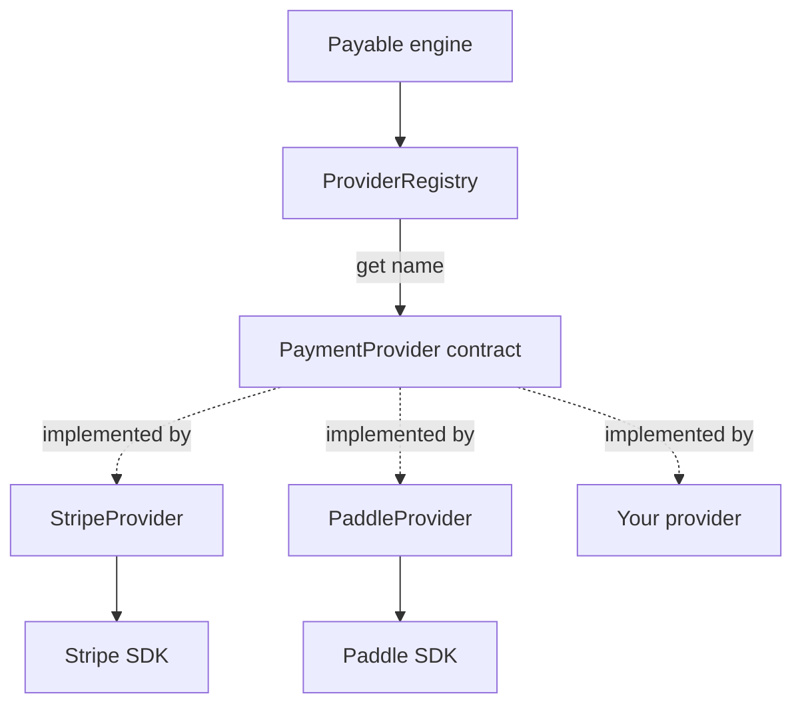

# Payment Providers

Every payment integration in `@akira-io/payable` is reduced to a single interface: `PaymentProvider`.
The engine never talks to Stripe or Paddle directly. It talks to the contract, and concrete adapters
translate domain DTOs into provider SDK calls and provider webhooks back into domain events. This keeps
the application and domain layers provider-agnostic and makes a new integration a matter of implementing
one interface.

The contract lives in `src/domain/contracts/payment-provider.contract.ts`.

## The `PaymentProvider` contract

`PaymentProvider` is the mandatory surface every provider implements. All methods that reach a provider
API are asynchronous and receive an `OperationContext` (`ctx`) carrying the idempotency key.

| Method | Input | Output |
| --- | --- | --- |
| `name` (readonly property) | - | `string` - the registry key, e.g. `'stripe'` |
| `capabilities()` | - | `ProviderCapabilities` |
| `createCustomer(input, ctx)` | `CreateCustomerInput` | `Promise<CustomerDTO>` |
| `updateCustomer(input, ctx)` | `UpdateCustomerInput` | `Promise<CustomerDTO>` |
| `createProduct(input, ctx)` | `CreateProductInput` | `Promise<ProductDTO>` |
| `updateProduct(input, ctx)` | `UpdateProductInput` | `Promise<ProductDTO>` |
| `createPrice(input, ctx)` | `CreatePriceInput` | `Promise<PriceDTO>` |
| `createCheckoutSession(input, ctx)` | `CreateCheckoutSessionInput` | `Promise<CheckoutSessionDTO>` |
| `updateSubscription(input, ctx)` | `UpdateSubscriptionInput` | `Promise<SubscriptionDTO>` |
| `cancelSubscription(input, ctx)` | `CancelSubscriptionInput` | `Promise<SubscriptionDTO>` |
| `resumeSubscription(input, ctx)` | `ResumeSubscriptionInput` | `Promise<SubscriptionDTO>` |
| `refund(input, ctx)` | `RefundInput` | `Promise<RefundResultDTO>` |
| `verifyWebhook(input)` | `WebhookVerificationInput` | `Promise<VerifiedWebhook>` |
| `reconcileSubscription(verified)` | `VerifiedWebhook` | `SubscriptionDTO \| null` (synchronous) |
| `billingPortal(input, ctx)` | `BillingPortalInput` | `Promise<BillingPortalDTO>` |

Notes on the non-obvious members:

- `verifyWebhook` takes no `ctx`. Its input is `{ payload, signature, headers? }` and it returns a
  `VerifiedWebhook` with `providerEventId`, raw `type`, the engine's `normalizedType`, and the event
  `data`. A failed signature throws `InvalidWebhookSignatureError`.
- `reconcileSubscription` is synchronous and pure. Given an already-verified webhook it returns a
  `SubscriptionDTO` when the normalized type starts with `subscription.`, otherwise `null`.

### Optional capability interfaces

Three operations are not part of the base contract because not every provider supports them. They are
modelled as separate interfaces and detected at runtime with type guards.

| Interface | Method(s) | Guard |
| --- | --- | --- |
| `ChargeCapable` | `charge(input, ctx): Promise<ChargeResultDTO>` | `isChargeCapable(provider)` |
| `DirectSubscriptionCapable` | `createSubscription(input, ctx): Promise<SubscriptionDTO>` | `isDirectSubscriptionCapable(provider)` |
| `InvoiceCapable` | `listInvoices(input): Promise<InvoiceDTO[]>`, `downloadInvoicePdf(id): Promise<InvoicePdfDTO>` | `isInvoiceCapable(provider)` |

The guards are structural duck-typing checks. For example, `isChargeCapable` returns `true` when
`typeof provider.charge === 'function'`. Code that needs a one-off charge or direct subscription
creation calls the guard first and falls back or errors when the provider does not implement it.

## The capabilities system

A provider declares a coarse-grained feature matrix through `capabilities()`, which returns a
`ProviderCapabilities` (`src/domain/dtos/capabilities.dto.ts`):

```ts
export interface ProviderCapabilities {
  checkout: boolean;
  subscriptions: boolean;
  trials: boolean;
  refunds: boolean;
  coupons: boolean;
  billingPortal: boolean;
  meteredBilling: boolean;
  invoicePdf: boolean;
}

export type ProviderCapability = keyof ProviderCapabilities;
```

This is distinct from the optional interfaces above. The interfaces answer "does this method exist?";
`ProviderCapabilities` answers "does the provider claim to support this feature?". The engine guards a
declared capability with `assertProviderCapability`
(`src/application/services/provider-capabilities/assert-provider-capability.ts`):

```ts
export function assertProviderCapability(
  provider: PaymentProvider,
  capability: ProviderCapability,
): void {
  if (!provider.capabilities()[capability]) {
    throw new ProviderCapabilityNotSupportedError(provider.name, capability);
  }
}
```

When the flag is `false`, it throws `ProviderCapabilityNotSupportedError`
(`src/domain/errors/provider-capability-not-supported.error.ts`) with code
`PROVIDER_CAPABILITY_NOT_SUPPORTED` and a message of the form
`Provider '<name>' does not support capability: <capability>`. The error context carries
`{ provider, capability }`.

- Purpose: fail fast and explicitly before reaching the provider API for an unsupported operation.
- Edge case: a provider may also throw `ProviderCapabilityNotSupportedError` from inside a method for a
  partial limitation. Paddle does this for partial refunds (see the Paddle integration page).

## The provider registry

`ProviderRegistry` (`src/payable.ts`) is a thin `Map<string, PaymentProvider>` wrapper:

| Method | Behavior |
| --- | --- |
| `register(name, provider)` | Stores a provider under `name`. |
| `get(name)` | Returns the provider, or throws `ProviderNotFoundError` (`PROVIDER_NOT_FOUND`) when absent. |
| `has(name)` | `true` when a provider is registered under `name`. |
| `names()` | Registered provider names, in insertion order. |

The registry is built from the resolved config and exposed via `payable.providers()`.

### Provider selection and ambiguity

Selection rules:

- Passing a name targets it explicitly: `payable.customer(billable, 'secondary')` routes to the
  `secondary` provider.
- Omitting the name defaults to the first registered provider: `names()[0]`.
- An unknown name throws `ProviderNotFoundError`.

Webhook routing has a stricter ambiguity rule (`Payable.defaultWebhookProvider` in `src/payable.ts`):
when more than one provider is registered and the incoming webhook does not name a provider, the engine
throws `PayableError` with code `WEBHOOK_PROVIDER_AMBIGUOUS` and the message
`Multiple providers are registered; route the webhook to /webhooks/:provider`. With a single provider it
is inferred.



## Implementing a custom provider

A minimal provider implements `PaymentProvider`, declares its `name` and `capabilities()`, and maps
domain DTOs to its API. Add the optional interfaces only for the operations it genuinely supports.

```ts
import type {
  PaymentProvider,
  ChargeCapable,
} from '@akira-io/payable';

export class AcmeProvider implements PaymentProvider, ChargeCapable {
  readonly name = 'acme';

  capabilities() {
    return {
      checkout: true,
      subscriptions: false,
      trials: false,
      refunds: true,
      coupons: false,
      billingPortal: false,
      meteredBilling: false,
      invoicePdf: false,
    };
  }

  async createCustomer(input, ctx) {
    const customer = await this.api.createCustomer(input.email, ctx.idempotencyKey);
    return { providerCustomerId: customer.id, email: customer.email, name: customer.name ?? null };
  }

  // ...implement the remaining contract methods, mapping to ProviderName-safe identifiers...

  async charge(input, ctx) {
    const charge = await this.api.charge(input.amount.amount(), ctx.idempotencyKey);
    return { providerPaymentId: charge.id, status: 'succeeded', amount: input.amount };
  }
}
```

Constraints to honour:

- `name` must be a valid `ProviderName` (`src/domain/value-objects/provider-name.ts`): lower-case,
  matching `^[a-z][a-z0-9_-]*$`. It is also the registry key callers pass to `customer(billable, name)`.
- `verifyWebhook` must throw `InvalidWebhookSignatureError` (not a generic error) on a bad signature so
  the webhook pipeline can reject it cleanly.
- `reconcileSubscription` should return `null` for non-subscription events.
- Keep `capabilities()` honest. The engine trusts it to gate features; lying produces failures at the
  provider API instead of a clean `ProviderCapabilityNotSupportedError`.

Register it like any built-in provider through the engine config (`{ providers: { acme: new AcmeProvider(...) } }`).

---

[Previous: Multi-tenancy](../features/16-multi-tenancy.md) · [Index](../00-index.md) · [Next: Stripe](18-stripe.md)
