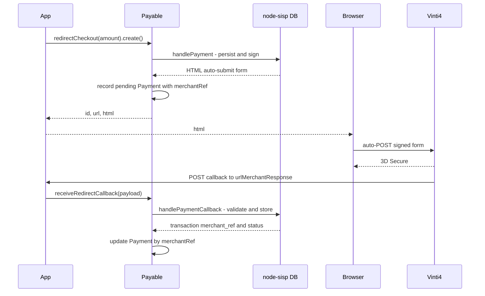

# SISP (Cabo Verde / vinti4)

SISP (Sistema de Pagamentos de Cabo Verde) is the Cabo Verde national payment gateway, also known as
**vinti4**. It is fundamentally different from Stripe and Paddle: there is no customers API, no
product/price catalog, no subscriptions, no billing portal, and no asynchronous signed webhook. A
payment is a one-time, browser-driven, hosted 3D Secure flow:

1. The merchant builds a SHA-512-signed HTML form and the **browser auto-POSTs** it to the vinti4
   hosted page (`https://mc.vinti4net.cv/Client_VbV_v2/biz_vbv_clientdata.jsp`).
2. The customer completes 3D Secure on the vinti4 page.
3. vinti4 **browser-POSTs a fingerprint-validated callback** back to the merchant's
   `urlMerchantResponse`.

There is no server-to-server "create a charge" call: the payment always requires the browser and the
hosted page.

The `SispProvider` adapter is exported from a dedicated subpath, `@akira-io/payable/sisp`, and wraps the
standalone [`@akira-io/sisp`](https://www.npmjs.com/package/@akira-io/sisp) package (`node-sisp`).

## Why a separate subpath

`SispProvider` is the only provider exported from `@akira-io/payable/sisp` instead of the main entry.
The reason is the optional-peer guarantee: the SISP adapter depends on the `@akira-io/sisp` types and
package, and surfacing those from the main entry would force **every** payable consumer to install
`@akira-io/sisp` just to type-check. Keeping SISP on its own subpath means:

- Consumers who do not use SISP import only `@akira-io/payable` and never need `@akira-io/sisp`.
- Consumers who use SISP install `@akira-io/sisp` (an optional peer, `>=1.0.0-beta.1`) and import
  `SispProvider` from `@akira-io/payable/sisp`.

`@akira-io/sisp` is declared in `peerDependenciesMeta` as optional; it is never a hard dependency of
payable.

## Two-layer model: who stores what

SISP wrapping uses two stores, by design - the same provider-store vs ledger split Stripe and Paddle
already use, except the SISP "provider store" is self-hosted by you (node-sisp) rather than in the
provider's cloud.

| Layer | Owner | Holds |
| --- | --- | --- |
| Protocol store | `node-sisp` (its own knex DB) | fingerprints, gateway transaction id, retry attempts, raw callback payload, 3D Secure data, refund tracking |
| Canonical ledger | payable storage (`payments`, `customers`) | the normalized `Payment` (amount, status, `providerPaymentId`), the local customer, cross-provider listing |

The two are joined by the **`merchantRef`**: payable stores it as `Payment.providerPaymentId`, and
node-sisp stores the transaction under the same reference. Overlap is limited to the reference fields
payable needs for a unified view - not a duplicated source of truth.

## Installation

```bash
npm install @akira-io/payable @akira-io/sisp
# plus a knex driver node-sisp will use, e.g. better-sqlite3 / pg / mysql2
```

## Registering the provider

`SispProvider` takes the full `SispConfig` (the same object `@akira-io/sisp`'s `createSisp` accepts), so
**every** SISP setting is available and configurable - nothing is decided by payable. On first use the
provider lazily calls `createSisp(config)` and reuses the instance.

```ts
import { createPayable } from '@akira-io/payable';
import { SispProvider } from '@akira-io/payable/sisp';

const payable = createPayable({
  providers: {
    sisp: new SispProvider({
      posId: process.env.SISP_POS_ID!,
      posAutCode: process.env.SISP_POS_AUT_CODE!,
      database: { client: 'better-sqlite3', connection: { filename: './sisp.db' }, autoMigrate: true },
      currency: '132',                 // CVE (ISO 4217 numeric)
      is3DSec: '0',
      urlMerchantResponse: 'https://shop.cv/sisp/callback',
      // generators, rateLimiting, transactionStatus, sandbox, ... all optional and forwarded
    }),
  },
  storage,
});
```

`SispProviderOptions` is an alias for `@akira-io/sisp`'s `SispConfig`. Required: `posId`, `posAutCode`,
`database`. Everything else is optional and forwarded verbatim to node-sisp.

### Injecting a pre-built instance (tests / advanced)

A second constructor argument accepts an already-created node-sisp instance (or a structural
`SispClient` fake), bypassing the lazy `createSisp`:

```ts
const sisp = await createSisp(config);
new SispProvider(config, sisp); // reuse the same instance the node-sisp adapter is mounted on
```

## Starting a payment - `redirectCheckout`

SISP has no catalog, so it does not use the catalog `checkout()` builder. Use the amount-based
`redirectCheckout` entry:

```ts
import { Money } from '@akira-io/payable';

const session = await payable
  .customer(billable)
  .redirectCheckout(Money.of(150000, 'CVE')) // 1 500.00 CVE in minor units
  .create({ reference: 'order-42' });

// session.id   -> the merchantRef payable generated and owns
// session.url  -> the vinti4 gateway endpoint
// session.html -> the ready auto-submit form; send it to the browser
res.send(session.html);
```

What `redirectCheckout(...).create()` does:

1. Ensures a **local customer** for the billable (no provider-side customer - SISP has none, so
   `providerCustomerId` is `null`). See [Customers](../features/08-customers-billable.md).
2. Generates the `merchantRef` using the configured `generators.merchantReference()` (default forwarded
   from node-sisp; override it through `SispConfig`).
3. Calls node-sisp's `handlePayment`, which **persists** the pending transaction and renders the signed
   auto-submit form - node-sisp stays the protocol store of record.
4. Records a pending `Payment` (`status: 'pending'`, `providerPaymentId: merchantRef`, linked to the
   local customer).

`CheckoutSessionDTO` gained an optional `html` field for this redirect-form shape; Stripe/Paddle keep
returning `url` only.

> Without a storage driver, `redirectCheckout` still returns the form (`html`) but persists nothing -
> no local customer, no pending payment.

## Handling the callback - `receiveRedirectCallback`

Point `urlMerchantResponse` at your own route, and pass the POST body to payable:

```ts
// POST /sisp/callback
const result = await payable.receiveRedirectCallback({ provider: 'sisp', payload: req.body });
// result -> { providerPaymentId, status, paymentUpdated }
```

This:

1. Calls `provider.handleRedirectCallback(payload)`, which runs node-sisp's `handlePaymentCallback`
   (fingerprint validation + protocol-store update) and returns a normalized
   `{ providerPaymentId, status }`.
2. Looks up the `Payment` by `findByProviderId('sisp', merchantRef)` and updates its status.

SISP transaction status maps to `PaymentStatus` as: `completed -> succeeded`, `failed -> failed`,
`cancelled -> canceled`, `refunded -> refunded`, `pending -> pending`.

After reconciliation, `payable.customer(billable).payments()` lists the SISP payment alongside any
other provider's.



## Refunds

`payable.customer(billable).refund(...)` (or the refund resource) routes to `SispProvider.refund`, which
looks the node-sisp transaction up by `providerPaymentId` (= `merchantRef`) and runs node-sisp's refund
builder. A missing transaction throws `PROVIDER_SISP_TRANSACTION_NOT_FOUND`.

## Amounts

payable `Money` is in **minor units** (CVE has 2 decimal places). node-sisp's payment amount is in
**major units** (escudos). `SispProvider` converts via the currency exponent
(`src/infrastructure/providers/sisp/sisp-amounts.ts`):

- `sispAmount(Money.of(150000, 'CVE'))` -> `1500` (minor -> major)
- `sispMoney(1500, 'CVE').amount()` -> `150000` (major -> minor)

Do not pass minor units to node-sisp directly; node-sisp multiplies the amount by 1000 internally for
the fingerprint, so passing minor units would double-scale.

## Caveats

- **3D Secure data.** `CreateCheckoutSessionInput` carries no customer address/email, so if the
  node-sisp instance is configured with `is3DSec: '1'`, `handlePayment` fails for lack of 3D Secure
  fields. For payable's unified `redirectCheckout`, use `is3DSec: '0'`; for full 3D Secure, mount
  node-sisp's own adapter for the payment route.
- **Rate limiting.** payable has no HTTP request context, so `handlePayment` runs node-sisp's pipeline
  with an empty IP. If node-sisp rate limiting is enabled, payable-initiated checkouts share the
  empty-IP bucket. Configure or disable rate limiting on the instance payable wraps.

---

[Previous: Paddle](19-paddle.md) · [Index](../00-index.md) · [Next: Storage (Knex)](../persistence/20-storage-knex.md)
