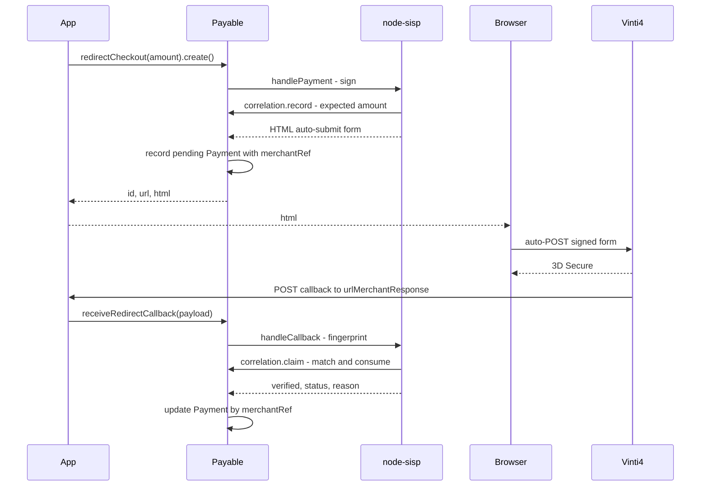

# SISP (Cabo Verde · vinti4)

SISP (Sistema de Pagamentos de Cabo Verde) is the Cabo Verde national payment gateway, also known as
**vinti4**. The current Payable adapter implements the browser-driven hosted payment contract shown
in the official [vinti4 technical example](https://www.vinti4.cv/documentation.aspx?id=585). It does
not declare customer, catalog, subscription, billing-portal, or asynchronous-webhook capabilities.
A payment uses this flow:

1. The merchant builds a SHA-512-signed HTML form and the **browser auto-POSTs** it to the vinti4
   hosted page (`https://mc.vinti4net.cv/Client_VbV_v2/biz_vbv_clientdata.jsp`).
2. The customer completes 3D Secure on the vinti4 page.
3. vinti4 **browser-POSTs a fingerprint-validated callback** back to the merchant's
   `urlMerchantResponse`.

There is no server-to-server "create a charge" call: the payment always requires the browser and the
hosted page.

The `SispProvider` adapter is exported from a dedicated subpath, `@akira-io/payable/sisp`, and wraps the
standalone [`@akira-io/sisp`](https://www.npmjs.com/package/@akira-io/sisp) package (`node-sisp`).

## Why a separate subpath

`SispProvider` is the only provider exported from `@akira-io/payable/sisp` instead of the main entry.
The reason is the optional-peer guarantee: the SISP adapter depends on the `@akira-io/sisp` types and
package, and surfacing those from the main entry would force **every** payable consumer to install
`@akira-io/sisp` just to type-check. Keeping SISP on its own subpath means:

- Consumers who do not use SISP import only `@akira-io/payable` and never need `@akira-io/sisp`.
- Consumers who use SISP install `@akira-io/sisp` (an optional peer, `>=1.0.0-beta.5`) and import
  `SispProvider` from `@akira-io/payable/sisp`.

`@akira-io/sisp` is declared in `peerDependenciesMeta` as optional; it is never a hard dependency of
payable.

## One store: payable owns the state

payable drives node-sisp in **stateless mode**. node-sisp keeps no database of its own; it signs
requests, validates fingerprints, and hands the verdict back. Everything durable lives in payable
storage, so a SISP payment has exactly one source of truth, the same as Stripe and Paddle.

| Table | Holds |
| --- | --- |
| `payable_payments` | the normalized `Payment` (amount, status, `providerPaymentId`), the local customer, cross-provider listing |
| `payable_redirect_correlations` | what payable asked the gateway for (`merchant_ref`, `merchant_session`, amount, currency, transaction code) and whether that callback has been claimed and processed |

The correlation row is what makes a callback trustworthy. A fingerprint proves the message came from
SISP; the correlation proves it is *the message payable is waiting for*, carrying the amount payable
asked for, and that it has not already been processed. Without it, verification degrades to
fingerprint-only: a replayed callback and a callback with a tampered amount both pass. Gateways
re-emit callbacks on timeout, so this is not hypothetical.

## Installation

```bash
npm install @akira-io/payable @akira-io/sisp
```

node-sisp no longer needs a database driver of its own. payable's storage driver carries the
correlation table, added by the `025-redirect-correlations` migration (knex) or the
`PayableRedirectCorrelation` model (Prisma).

## Registering the provider

`SispProvider` takes the full `StatelessSispConfig` (the same object `@akira-io/sisp`'s
`createStatelessSisp` accepts), so **every** SISP setting is available and configurable. On first use
the provider lazily calls `createStatelessSisp(config)` and reuses the instance.

The one setting you must supply is `correlation`. `payableSispCorrelationStore(storage)` implements
node-sisp's `PaymentCorrelationStore` over payable's own tables:

```ts
import { createPayable } from '@akira-io/payable';
import { SispProvider, payableSispCorrelationStore } from '@akira-io/payable/sisp';

const payable = createPayable({
  providers: {
    sisp: new SispProvider({
      posId: process.env.SISP_POS_ID!,
      posAutCode: process.env.SISP_POS_AUT_CODE!,
      correlation: payableSispCorrelationStore(storage),
      currency: '132',                 // CVE (ISO 4217 numeric)
      is3DSec: '0',
      urlMerchantResponse: 'https://shop.cv/sisp/callback',
      // generators, transactionStatus, sandbox, ... all optional and forwarded
    }),
  },
  storage,
});
```

`SispProviderOptions` is an alias for `@akira-io/sisp`'s `StatelessSispConfig`. Required: `posId`,
`posAutCode`, `correlation`. Everything else is optional and forwarded verbatim to node-sisp.

`payableSispCorrelationStore` takes the storage driver plus an optional `{ clock, tenantId }`. It
throws `PROVIDER_SISP_CORRELATION_STORAGE_MISSING` when the driver has no `redirectCorrelations`
repository, which is what a custom storage driver written before this table existed will look like.

Starting a payment without a correlation store is refused by node-sisp itself
(`CorrelationRequiredError`), so a misconfigured provider fails at the first checkout rather than at
the first tampered callback.

## Declared capabilities

```ts
capabilities(): ProviderCapabilities {
  return new Set(['checkout']);
}
```

SISP declares only the current Payable capabilities it supports directly. It does not declare
`charges` because there is no server-to-server charge API; every payment starts through hosted
checkout. It does not declare `webhooks` because vinti4 reconciliation is a browser callback handled
through `RedirectCallbackCapable`, not an asynchronous signed provider webhook.

### Injecting a pre-built instance (tests / advanced)

A second constructor argument accepts an already-created node-sisp instance (or a structural
`SispClient` fake), bypassing the lazy `createStatelessSisp`. A third accepts the function that turns
a raw gateway body into a normalized callback payload; supply it whenever you inject a fake client,
otherwise the provider loads node-sisp's `callbackPayloadFrom` and your hand-made payload will not
match the field names SISP actually posts:

```ts
const sisp = createStatelessSisp(sispProviderConfig(config));
new SispProvider(config, sisp); // reuse the same instance the node-sisp adapter is mounted on
```

Build that instance from `sispProviderConfig(config)`, not from `config` directly. The provider
normally applies one adjustment of its own before constructing the client (see the caveat on
client-supplied merchant identifiers below), and an instance built without it rejects every checkout
with a 422 instead of returning a form.

## Starting a payment - `redirectCheckout`

SISP has no catalog, so it does not use the catalog `checkout()` builder. Use the amount-based
`redirectCheckout` entry:

```ts
import { Money } from '@akira-io/payable';

const session = await payable
  .customer(billable)
  .redirectCheckout(Money.of(150000, 'CVE')) // 1 500.00 CVE in minor units
  .create({ reference: 'order-42' });

// session.id   -> the merchantRef payable generated and owns
// session.url  -> the vinti4 gateway endpoint
// session.html -> the ready auto-submit form; send it to the browser
res.send(session.html);
```

What `redirectCheckout(...).create()` does:

1. Ensures a **logical customer** for the billable. SISP has no provider-side customer, so no
   `CustomerProviderBinding` is created. See [Customers](../features/08-customers-billable.md).
2. Derives the `merchantRef`. When an `idempotencyKey` is present, it is hashed with SHA-256 and the
   reference becomes `R` + the first 14 hex characters upper-cased (`sispMerchantReference`), so the same
   key always yields the same reference. With no idempotency key it falls back to the configured
   `generators.merchantReference()` (forwarded from node-sisp; override it through `StatelessSispConfig`).
3. Calls node-sisp's `handlePayment`, which records the correlation row through the store you
   configured and renders the signed auto-submit form. The `merchantSession` on that row is generated
   by node-sisp, so a retry of the same `merchantRef` is its own row and its own claim.
4. Records a pending `Payment` (`status: 'pending'`, `providerPaymentId: merchantRef`, linked to the
   local customer).

`createCheckoutSession` guards its inputs up front: a non-`payment` mode throws
`PROVIDER_OPERATION_UNSUPPORTED` (SISP only supports one-time payment checkouts), and a missing amount
throws `CHECKOUT_AMOUNT_REQUIRED`.

`CheckoutSessionDTO` gained an optional `html` field for this redirect-form shape; Stripe/Paddle keep
returning `url` only.

> Without a storage driver, `redirectCheckout` still returns the form (`html`) but persists nothing -
> no local customer, no pending payment.

## Handling the callback - `receiveRedirectCallback`

Point `urlMerchantResponse` at your own route, and pass the POST body to payable:

```ts
// POST /sisp/callback
const result = await payable.receiveRedirectCallback({ provider: 'sisp', payload: req.body });
// result -> { providerPaymentId, status, paymentUpdated }
```

Pass the gateway's POST body **verbatim**. The provider normalizes it with node-sisp's
`callbackPayloadFrom`, which reads SISP's own field names (`merchantRespMerchantRef`,
`merchantRespPurchaseAmount`, `resultFingerPrint`, ...). A hand-built payload using the camelCase
names will normalize to empty strings and be rejected as unknown.

This:

1. Calls `provider.handleRedirectCallback(payload)`, which runs node-sisp's `handleCallback`:
   fingerprint check, then the correlation claim and the amount/currency/transaction-code match.
2. Looks up the `Payment` by `findByProviderId('sisp', merchantRef)` and updates its status.

### Authenticity is not the payment verdict

node-sisp's outcome carries `verified` and `status`, and they answer different questions.

- `verified: true` means the message is authentic **and** matches the payment payable recorded. It
  says nothing about whether the gateway approved the charge. A correctly signed decline is
  `verified: true` with `status: 'failed'`.
- `verified: false` means the message is not one payable can act on. `outcome.reason` says why.

`SispProvider` keeps the two apart. A verified outcome is mapped to a `PaymentStatus` and returned; an
unverified one throws `PROVIDER_SISP_INVALID_CALLBACK` with the reason in the error context:

| `reason` | What happened |
| --- | --- |
| `invalid_callback_fingerprint` | the signature does not hold - the message is not from SISP, or was altered |
| `unknown_transaction` | no correlation row for this `merchantRef` + `merchantSession` pair |
| `callback_replayed` | that pair was already claimed; the gateway re-delivered |
| `callback_details_mismatch` | authentic, but the amount, currency, transaction code or POS id is not what payable asked for |

The same distinction applies to node-sisp's `callback:verified` event, which fires for every authentic
callback including declines. If you listen to it, branch on `event.status`, never on the event name.

**Cancellations are not reconciled here.** When the customer abandons the hosted page, vinti4 posts
`UserCancelled` with a body that carries none of the fields a normal callback does. node-sisp handles
that case in its own HTTP adapter, not in `handleCallback`, so a cancellation reaching
`receiveRedirectCallback` fails the fingerprint check and the payment stays `pending`. The correlation
row is never claimed, so it does not appear in the orphan list either. Mount node-sisp's own callback
route if you need cancellations reconciled.

SISP transaction status maps to `PaymentStatus` as: `completed -> succeeded`, `failed -> failed`,
`cancelled -> canceled`, `refunded -> refunded`, `pending -> pending`.

`verifyCallback(payload)` remains available and checks the fingerprint **only**. It does not claim the
correlation, so it neither detects a replay nor compares the amount. Use `handleRedirectCallback` for
anything that decides whether a customer has paid.

After reconciliation, `payable.customer(billable).payments()` lists the SISP payment alongside any
other provider's.


```mermaid
sequenceDiagram
  participant App
  participant Payable
  participant NodeSisp as node-sisp
  participant Browser
  participant Vinti4

  App->>Payable: redirectCheckout(amount).create()
  Payable->>NodeSisp: handlePayment - sign
  NodeSisp->>Payable: correlation.record - expected amount
  NodeSisp-->>Payable: HTML auto-submit form
  Payable->>Payable: record pending Payment with merchantRef
  Payable-->>App: id, url, html
  App-->>Browser: html
  Browser->>Vinti4: auto-POST signed form
  Vinti4-->>Browser: 3D Secure
  Vinti4->>App: POST callback to urlMerchantResponse
  App->>Payable: receiveRedirectCallback(payload)
  Payable->>NodeSisp: handleCallback - fingerprint
  NodeSisp->>Payable: correlation.claim - match and consume
  NodeSisp-->>Payable: verified, status, reason
  Payable->>Payable: update Payment by merchantRef
```

## Refunds

SISP does **not** declare the `refunds` capability. The vinti4 integration has no server-to-server
reversal API, and stateless node-sisp has no refund surface at all. `payable.refund(...)` on a SISP
payment throws `PROVIDER_CAPABILITY_NOT_SUPPORTED` and leaves the payment untouched. Reversals must be
performed through SISP's own back office until the gateway exposes a real refund endpoint.

## Amounts

payable `Money` is in **minor units** (CVE has 2 decimal places). node-sisp's payment amount is in
**major units** (escudos). `SispProvider` converts via the currency exponent
(`src/infrastructure/providers/sisp/sisp-amounts.ts`):

- `sispAmount(Money.of(150000, 'CVE'))` -> `1500` (minor -> major)
- `sispMoney(1500, 'CVE').amount()` -> `150000` (major -> minor)

Do not pass minor units to node-sisp directly; node-sisp multiplies the amount by 1000 internally for
the fingerprint, so passing minor units would double-scale.

## Caveats

- **3D Secure data.** `CreateCheckoutSessionInput` carries no customer address/email, so if the
  node-sisp instance is configured with `is3DSec: '1'`, `handlePayment` fails for lack of 3D Secure
  fields. For payable's unified `redirectCheckout`, use `is3DSec: '0'`; for full 3D Secure, mount
  node-sisp's own adapter for the payment route.
- **One payment per merchant reference.** The correlation store refuses a second checkout that reuses
  a `merchantRef` under a different `merchantSession`, with
  `PROVIDER_SISP_DUPLICATE_MERCHANT_REFERENCE`. Since the reference is derived from the idempotency
  key, that means one live form per key. Without this, two forms could be signed for one pending
  `Payment` and a customer who submitted both would be charged twice with nothing raised. Stateful
  node-sisp refused the duplicate for the same reason.
- **Client-supplied merchant identifiers.** node-sisp rejects a `merchantRef` in the request body by
  default (`paymentValidation.allowClientMerchantIdentifiers: false`), because in its own HTTP adapter
  that field arrives from a browser. Here payable *is* the server and derives the reference from the
  idempotency key, so `SispProvider` turns the flag on unless your config sets it explicitly. Without
  it, every checkout would come back as a 422 instead of a form.
- **Claims that are never processed.** The callback is handled at-least-once: node-sisp claims the
  correlation before it records the outcome. A process that dies in between leaves a row claimed with
  no outcome, and that callback cannot be replayed - a second delivery is reported as
  `callback_replayed`. The claim deliberately does not expire, because an expiring claim is a replay
  window. Find these rows with `payable.orphanedRedirectClaims().run({ provider: 'sisp' })` and settle
  them against the gateway; see [Operations](../30-operations.md).
- **Tenancy.** `payableSispCorrelationStore` binds one `tenantId` when it is built, and the provider
  is registered once. On a multi-tenant deployment, build one provider per tenant, or leave the tenant
  null and scope reconciliation another way.

---

[Previous: Paddle](19-paddle.md) · [Index](../00-index.md) · [Next: Revolut](21-revolut.md)
