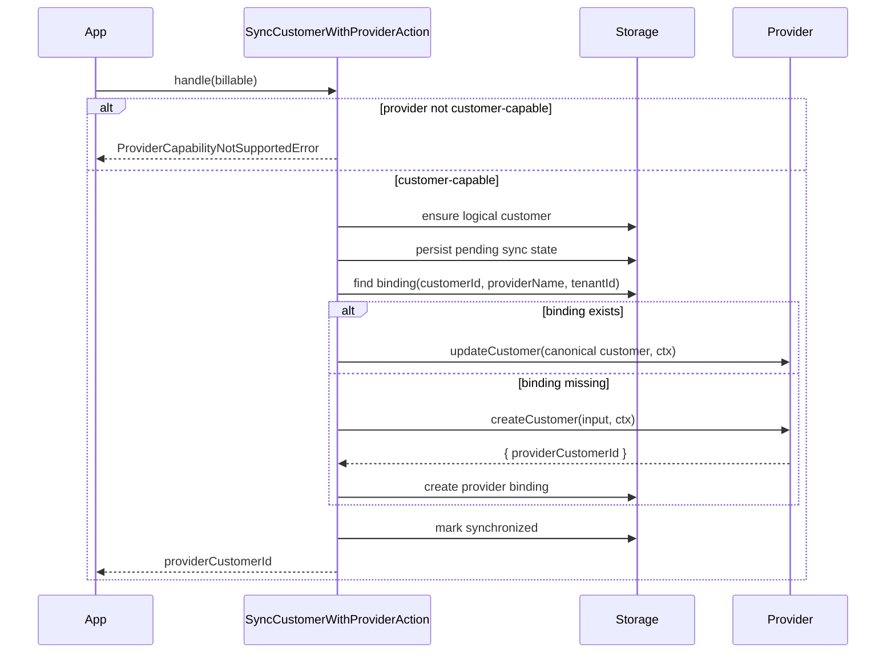

Every billing operation in Payable starts from a `Billable` - the integrating application's own
record (a user, a team, an organization) that should be billed. Payable never owns that record. It
persists one provider-neutral `Customer` and maps that customer to zero or more provider accounts
through `CustomerProviderBinding` records.

`create`, `update`, `get`, `find`, `list`, and `binding` use storage only. They do not resolve a
provider, inspect capabilities, or make a network request. This allows logical customer management
when no payment provider is registered or while a provider is unavailable.

Provider synchronization is explicit. Select a registered provider account and call `sync`. The
provider must declare the `customers` capability.

The registered provider name is the account boundary. For example, `stripe-eu` and `stripe-us` may
use the same adapter type while retaining independent customer identities.

```ts
const customer = await payable.customers('stripe').create(billable);
await payable.customers('stripe').sync(billable);
await payable.customers('paddle').sync(billable);

const stripeBinding = await payable.customers('stripe').binding(billable);
const paddleBinding = await payable.customers('paddle').binding(billable);

customer.id; // one stable local id
stripeBinding?.providerCustomerId; // e.g. cus_...
paddleBinding?.providerCustomerId; // e.g. ctm_...
```

## List logical customers

`payable.customers(providerName?, tenantId?).list()` reads Payable's canonical customer storage. It
does not call a payment provider, inspect provider capabilities, or require provider credentials.
This differs from provider-native customer endpoints such as
[Stripe's customer list](https://docs.stripe.com/api/customers/list) and
[Paddle's customer list](https://developer.paddle.com/api-reference/customers/list-customers/),
which query customers held by one provider account.

```ts
const page = await payable.customers(undefined, tenantId).list({
  limit: 25,
  email: '@example.com',
  name: 'ada',
});

for (const customer of page.items) {
  customer.id;
}

const nextPage = page.nextCursor
  ? await payable.customers(undefined, tenantId).list({
      limit: 25,
      cursor: page.nextCursor,
      email: '@example.com',
      name: 'ada',
    })
  : null;
```

Pages contain `{ items, nextCursor, hasMore }`. The default limit is 25 and the maximum is 100.
Ordering is deterministic by creation time and logical customer ID, newest first. Treat
`nextCursor` as opaque and pass it back unchanged. Newer customers created between requests do not
shift the continuation boundary. Repeat the same filters on every page request.

Filters use these local semantics:

- `id` is an exact logical customer ID.
- `billableType` and `billableId` are exact values and may be combined for a billable lookup.
- `email` and `name` are case-insensitive substring searches.
- `find(id)` retrieves one logical customer by exact ID. `get(billable)` retrieves one by billable
  type and ID.

Bindings are excluded by default. Set `includeBindings: true` to add only the binding `id`,
`provider`, and `providerCustomerId` for each binding. Provider configuration and credentials are
never returned.

```ts
const pageWithBindings = await payable.customers(undefined, tenantId).list({
  includeBindings: true,
});
```

HTTP adapters expose the same local collection at `GET /canonical/customers` and exact local reads
at `GET /canonical/customers/:id`. These routes are separate from the existing billable lookup at
`GET /customers`.

When tenancy is enabled, pass the tenant ID when constructing the customer resource. Every customer
filter, cursor page, exact lookup, and binding query stays inside that tenant partition.

## Migrating from beta3

This changes the public `Customer` shape. Code that read `customer.provider` or
`customer.providerCustomerId` must select the registered provider and read its binding:

```ts
const customer = await payable.customers('stripe').get(billable);
const binding = await payable.customers('stripe').binding(billable);

binding?.provider;
binding?.providerCustomerId;
```

Run `migrate(knex)` before starting the updated application. Migration
`008-customer-provider-bindings` backfills non-null beta3 provider ids into bindings and removes the
legacy columns only after verifying the backfill.

Prisma users must edit the generated migration instead of accepting a direct drop of `provider` and
`provider_customer_id`. Use an expand/backfill/contract migration:

1. Add `tenant_key` to `payable_customers` with `NOT NULL DEFAULT ''`, populate it with
   `COALESCE(tenant_id, '')`, and add the unique index from `prisma/models.prisma`.
2. Create `payable_customer_provider_bindings` using Prisma's generated DDL, but retain both legacy
   customer columns.
3. Backfill the beta3 identity before any drop. A beta3 customer has at most one provider identity,
   so its customer id is also a collision-free binding id:

```sql
INSERT INTO payable_customer_provider_bindings
  (id, customer_id, provider, provider_customer_id, created_at, updated_at)
SELECT id, id, provider, provider_customer_id, created_at, updated_at
FROM payable_customers
WHERE provider_customer_id IS NOT NULL;
```

4. Verify that this query returns zero rows:

```sql
SELECT customer.id
FROM payable_customers AS customer
LEFT JOIN payable_customer_provider_bindings AS binding
  ON binding.customer_id = customer.id
 AND binding.provider = customer.provider
 AND binding.provider_customer_id = customer.provider_customer_id
WHERE customer.provider_customer_id IS NOT NULL
  AND binding.id IS NULL;
```

5. Only after verification, drop the old unique constraint and the two legacy columns. If an
   interrupted migration may be rerun, use `ON CONFLICT (customer_id, provider) DO NOTHING` on
   PostgreSQL/SQLite or `INSERT IGNORE` on MySQL for the backfill statement.

## The `Billable` shape

```ts
export interface Billable {
  billableType: string;
  billableId: string;
  email: string;
  name?: string;
}
```

- `billableType` and `billableId` together identify the application record (for example
  `{ billableType: 'User', billableId: '1' }`). They are the key used to look up and store the local
  customer row.
- `email` is forwarded to the provider when the provider customer is created.
- `name` is optional and forwarded when present.

Payable performs **no ownership check** on the `Billable`. The HTTP adapters take `billable` straight
from the request body; the integrating application is responsible for authentication and for verifying
that the caller owns the `Billable`.

## `CustomerContext` - the entry point

`payable.customer(billable, providerName?, tenantId?)` returns a `CustomerContext`. This is the root
of the fluent API: every customer-scoped operation hangs off it.

```ts
const customer = payable.customer({
  billableType: 'User',
  billableId: '1',
  email: 'user@example.com',
});
```

`CustomerContext` exposes:

| Method | Returns | Covered in |
| --- | --- | --- |
| `newSubscription(name)` | `SubscriptionBuilder` | [09-checkout](/features/09-checkout/), [10-subscriptions](/features/10-subscriptions/) |
| `checkout()` | `CheckoutBuilder` | [09-checkout](/features/09-checkout/) |
| `redirectCheckout(amount: Money)` | `RedirectCheckoutBuilder` | [09-checkout](/features/09-checkout/) |
| `subscription(name)` | `SubscriptionManager` | [10-subscriptions](/features/10-subscriptions/) |
| `charge(request)` | `Promise<Payment>` | [11-charges-refunds](/features/11-charges-refunds/) |
| `invoices(limit?)` | `Promise<InvoiceDTO[]>` | [12-invoices-portal](/features/12-invoices-portal/) |
| `payments(options?: ListOptions)` | `Promise<Payment[]>` | [11-charges-refunds](/features/11-charges-refunds/) |
| `subscriptions(options?: ListOptions)` | `Promise<Subscription[]>` | [10-subscriptions](/features/10-subscriptions/) |
| `billingPortal(returnUrl)` | `Promise<BillingPortalDTO>` | [12-invoices-portal](/features/12-invoices-portal/) |

### Provider and tenant resolution

`payable.customer(...)` builds a `BillingDependencies` bundle through `Payable.dependencies()`:

- **Provider.** If `providerName` is omitted, the first registered provider is used
  (`this.registry.names()[0]`). If no provider is registered, a `ProviderNotFoundError` is thrown.
  With more than one provider registered, pass `providerName` explicitly to avoid binding to whatever
  happens to be first.
- **Tenant.** If tenancy is enabled (`resolved.tenantEnabled`) and `tenantId` is `undefined` or
  `null`, a `PayableError` with code `TENANT_REQUIRED` is thrown. When tenancy is disabled, the
  resolved `tenantId` is `null`. See [16-multi-tenancy](/features/16-multi-tenancy/).

`BillingDependencies`:

```ts
export interface BillingDependencies {
  provider: PaymentProvider;
  providerName: string;
  clock: Clock;
  storage?: StorageDriver;
  tenantId?: string | null;
  authorizationEnabled?: boolean;
  idempotency?: IdempotencyService;
  logger?: Logger;
}
```

`storage` is optional, so a `CustomerContext` can be built without a storage driver - but the
operations that need persistence (charge, subscription management, refund) fail explicitly when it is
absent.

## Synchronize with a provider account

`payable.customers(providerName, tenantId).sync(billable)` turns the stored logical customer into a
provider customer id. The registered provider name is required. Checkout, charge, subscription, and
portal flows may run the same action internally when they need a binding.

Behavior:

1. The action loads or creates the logical customer by `(tenantId, billableType, billableId)`.
2. It checks the selected provider's `customers` capability before recording an attempt.
3. It atomically claims a short `pending` lease without changing the logical customer. Concurrent
   callers wait for the lease owner and reuse its binding instead of creating a second remote
   customer.
4. If a binding exists, it calls `updateCustomer` with canonical local email and name. Otherwise it
   calls `createCustomer` with a stable idempotency key.
5. It stores the binding and marks the lifecycle `synchronized`. Audit and outbox records identify
   the logical customer, provider account name, and provider customer id.



`syncState(billable)` returns `null` when synchronization was never attempted. Persisted states are:

- `pending`: an attempt started and may be retried with the same deterministic key.
- `synchronized`: the provider result and local binding are durable.
- `failed`: the provider call failed. `failureCode` stores only a code, never a provider message or
  credentials.
- `reconciliation_required`: the provider call may have succeeded but its result did not become
  durable. When the provider customer id is known, a retry repairs the binding without another
  remote create. When a provider has no native create idempotency and a timeout leaves the id
  unknown, Payable blocks automatic retries until the remote result is manually reconciled.

A failed or pending attempt never deletes or rewrites the logical customer. A retry increments
`attempts`. Payable may reclaim an expired lease when a binding already exists or the provider
declares native create idempotency. Without either guarantee, expiry changes the state to
`reconciliation_required` with failure code `CUSTOMER_PROVIDER_SYNC_LEASE_EXPIRED`; automatic
create retries stay blocked while the original request may still be in flight.

An expired attempt cannot overwrite a newer attempt's state or publish its normal completion event.
Any remote customer id that loses a binding race produces `customer.provider.orphaned` audit and
outbox entries, including when the losing attempt records reconciliation before the winner repairs
the lifecycle state. Each registered provider account has an independent binding and lifecycle row.

Providers that do not declare native customer-create idempotency require both the storage driver and
its customer synchronization lifecycle repository. Sync fails with
`CUSTOMER_PROVIDER_DURABLE_SYNC_REQUIRED` before the remote call when either is absent. A custom
provider with no `customerCreateIdempotency` declaration is treated conservatively as non-native.

## Inputs and outputs

| Concern | Input | Output |
| --- | --- | --- |
| Build a context | `Billable`, optional `providerName`, optional `tenantId` | `CustomerContext` |
| Ensure/select a customer | `payable.customers(undefined, tenantId).create(Billable)` | `Promise<Customer>` (provider-neutral) |
| Read the selected binding | `payable.customers(providerName).binding(Billable)` | `Promise<CustomerProviderBinding \| null>` |
| Sync to provider | `payable.customers(providerName, tenantId).sync(Billable)` | `Promise<string>` (the `providerCustomerId`) |
| Read sync lifecycle | `payable.customers(providerName, tenantId).syncState(Billable)` | `Promise<CustomerProviderSyncState \| null>` |
| Provider create payload | `CreateCustomerInput` (`{ email, name?, billableType, billableId, metadata? }`) | `CustomerDTO` (`{ providerCustomerId, email, name }`) |

## Edge cases

- **No provider registered.** Logical customer CRUD continues to work. `sync` requires a registered
  provider name.
- **Multiple providers.** Select the registered provider name when calling `sync` or `binding`.
- **Tenancy enabled, no tenant id.** `payable.customer(...)` throws `PayableError`
  (`TENANT_REQUIRED`).
- **No storage driver.** Logical customer management fails with `CUSTOMER_STORAGE_REQUIRED`.
- **A new provider for an existing customer.** The logical customer is reused and only a new binding
  is added.
- **Two accounts of the same provider type.** Register them under distinct keys such as `stripe-eu`
  and `stripe-us`; bindings use those keys, not `provider.name`.
- **Provider without customer support.** Local CRUD still works. Explicit sync fails with
  `PROVIDER_CAPABILITY_NOT_SUPPORTED` before a remote call.

The Express, Fastify, and Nest adapters expose `POST /customers/sync` with `{ provider, billable }`.
The MCP adapter exposes `customer_sync` with the same required provider name.
